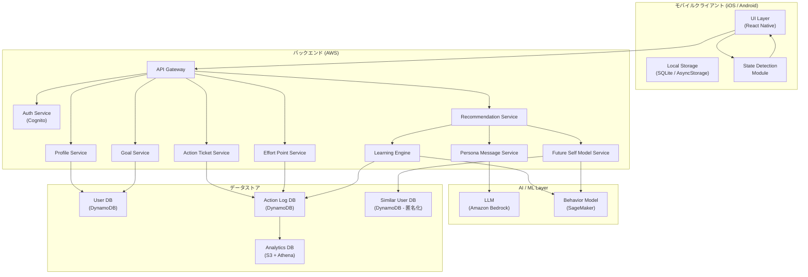
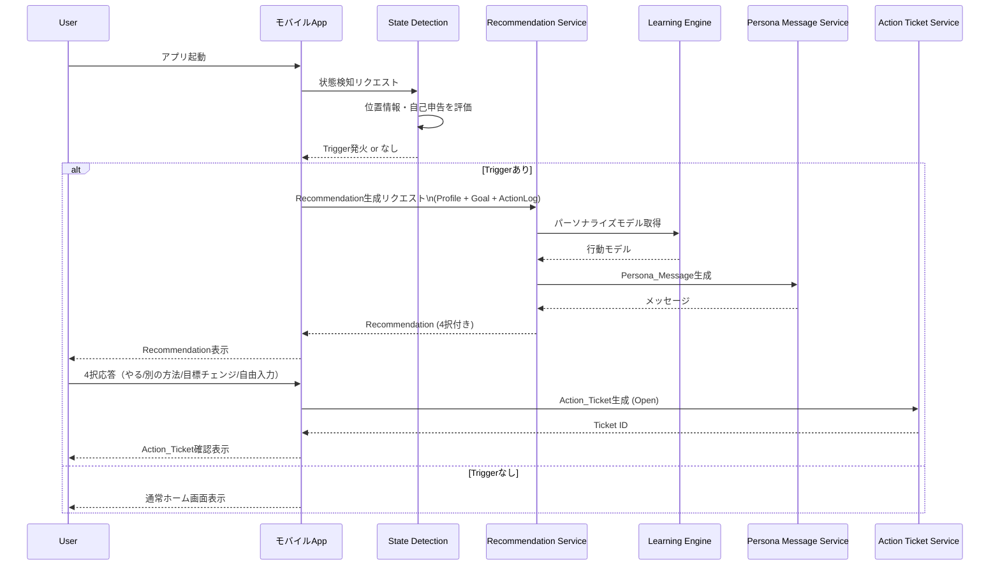
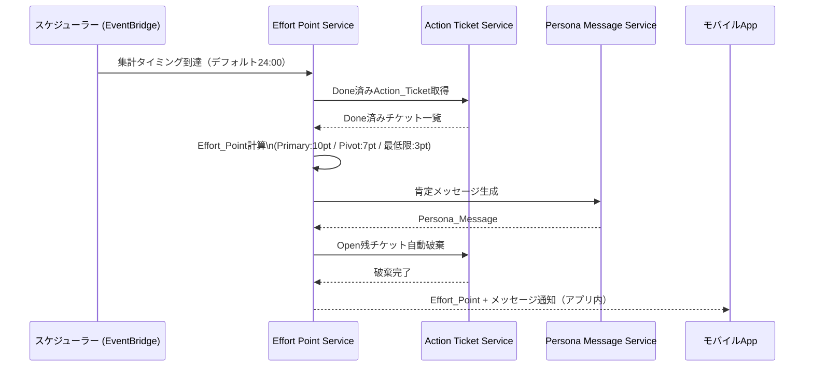

# 設計ドキュメント: だが、それでいい（DagaSoreDeIi_App）

## 概要

「だが、それでいい」は、ユーザーが「今日も何かできた」を見つけるための行動支援アプリケーションです。従来の習慣トラッカーが「一つの習慣をストイックに継続させる」ことを目的とするのに対し、本アプリは目標通りにできた日を最高としつつも、別のことができた日も十分に価値があると捉えます。

### 設計の基本方針

- **Flexible Achievement First**: 0点か100点かではなく、何かできた日はみんな合格点
- **AI-Driven Personalization**: ユーザーのProfile・Action_Log・Future_Self_Modelを組み合わせたパーソナライズ
- **Persona-Centric UX**: すべてのメッセージを「未来の自分」が語りかけるスタイルで統一
- **Progressive Learning**: Learning_Engineによる継続的な最適化
- **Privacy by Design**: センシティブデータの明示的同意と匿名化

### スコープ（v1）

- アプリ内表示のみ（プッシュ通知はv2以降）
- アプリ起動時のState_Detection（バックグラウンドトリガーはv2以降）
- モバイルアプリ（iOS / Android）

---

## アーキテクチャ

### システム全体構成



### アプリ起動時のフロー



### 1日の終わりのフロー（Effort Point集計）



---

## コンポーネントとインターフェース

### 1. Profile Service

ユーザーのプロフィール情報を管理するサービス。

```typescript
interface ProfileService {
  // プロフィール作成（オンボーディング）
  createProfile(userId: string, data: ProfileInput): Promise<Profile>;
  
  // プロフィール取得
  getProfile(userId: string): Promise<Profile>;
  
  // プロフィール更新（ユーザー手動）
  updateProfile(userId: string, data: Partial<ProfileInput>): Promise<Profile>;
  
  // プロフィール自動更新（Learning_Engine経由）
  autoUpdateProfile(userId: string, actionLog: ActionLog): Promise<Profile>;
  
  // 更新履歴取得
  getUpdateHistory(userId: string): Promise<ProfileUpdateHistory[]>;
  
  // 得意な行動パターン分析（過去30日）
  analyzeBehaviorPattern(userId: string): Promise<BehaviorPattern>;
  
  // オンボーディング完了チェック
  isOnboardingComplete(userId: string): Promise<boolean>;
}
```

### 2. Goal Service

Goalの管理（CRUD・Primary/Pivot切り替え）を担当するサービス。

```typescript
interface GoalService {
  // Goal作成
  createGoal(userId: string, data: GoalInput): Promise<Goal>;
  
  // Goal一覧取得
  listGoals(userId: string): Promise<Goal[]>;
  
  // Goal更新
  updateGoal(userId: string, goalId: string, data: Partial<GoalInput>): Promise<Goal>;
  
  // Goal削除（確認フラグ付き）
  deleteGoal(userId: string, goalId: string, confirmed: boolean): Promise<void>;
  
  // Primary_Goal設定
  setPrimaryGoal(userId: string, goalId: string): Promise<Goal>;
  
  // Pivot_Goal候補取得（Primary以外）
  getPivotGoalCandidates(userId: string): Promise<Goal[]>;
  
  // AIによるPivot候補生成（Pivot_Goalが存在しない場合）
  generateAIPivotCandidates(userId: string): Promise<AIPivotCandidate[]>;
}
```

### 3. State Detection Module（クライアントサイド）

アプリ起動時にユーザーの状態を検知し、Triggerを評価するモジュール。

```typescript
interface StateDetectionModule {
  // 状態検知実行（アプリ起動時）
  detectState(userId: string): Promise<DetectedState>;
  
  // Trigger評価
  evaluateTriggers(state: DetectedState, settings: TriggerSettings): Promise<Trigger | null>;
  
  // 位置情報取得（権限チェック付き）
  getLocationIfPermitted(): Promise<Location | null>;
  
  // 心理状態入力受付
  acceptPsychologicalInput(input: string): Promise<PsychologicalState>;
  
  // Triggerソース設定取得
  getTriggerSettings(userId: string): Promise<TriggerSettings>;
  
  // 複数Trigger優先度評価
  selectHighestPriorityTrigger(triggers: Trigger[]): Trigger;
}
```

### 4. Recommendation Service

Triggerに基づいてRecommendationを生成するサービス。

```typescript
interface RecommendationService {
  // 初回Recommendation生成（Primary_Goal関連）
  generateInitialRecommendation(
    userId: string,
    trigger: Trigger
  ): Promise<Recommendation>;
  
  // 同Goal内別アクション提案（「いいえ（別の方法で）」応答時）
  generateAlternativeAction(
    userId: string,
    currentGoalId: string
  ): Promise<Recommendation>;
  
  // Pivot提案（「目標チェンジ」応答時）
  generatePivotRecommendation(
    userId: string
  ): Promise<Recommendation>;
  
  // 最低限行動提案（Pivot後も拒否された場合）
  generateMinimalActionRecommendation(
    userId: string
  ): Promise<Recommendation>;
  
  // 自由入力受付
  acceptFreeInput(
    userId: string,
    input: string
  ): Promise<Recommendation>;
}
```

### 5. Action Ticket Service

Action_Ticketのライフサイクル管理を担当するサービス。

```typescript
interface ActionTicketService {
  // Action_Ticket生成（Open）
  createTicket(
    userId: string,
    data: ActionTicketInput
  ): Promise<ActionTicket>;
  
  // Action_Ticket一覧取得（Open）
  listOpenTickets(userId: string): Promise<ActionTicket[]>;
  
  // Action_TicketをDoneに更新（自己申告）
  completeTicket(
    userId: string,
    ticketId: string
  ): Promise<ActionTicket>;
  
  // 1日の終わりにOpenチケットを自動破棄
  discardExpiredTickets(userId: string, date: string): Promise<DiscardResult>;
  
  // 破棄済みチケット履歴取得
  getDiscardedTicketHistory(userId: string): Promise<ActionTicket[]>;
  
  // Done済みチケット取得（Effort_Point集計用）
  getDoneTicketsByDate(userId: string, date: string): Promise<ActionTicket[]>;
}
```

### 6. Effort Point Service

Effort_Pointの計算・付与・集計を担当するサービス。

```typescript
interface EffortPointService {
  // 1日の集計・ポイント付与
  calculateAndAwardPoints(userId: string, date: string): Promise<EffortPointResult>;
  
  // 累計ポイント取得
  getTotalPoints(userId: string): Promise<number>;
  
  // 週間・月間推移取得
  getPointHistory(
    userId: string,
    period: 'weekly' | 'monthly'
  ): Promise<PointHistory>;
  
  // 集計タイミング設定（ユーザーカスタマイズ）
  setDailyResetTime(userId: string, time: string): Promise<void>;
  
  // マイルストーン達成チェック（100の倍数）
  checkMilestone(userId: string, newTotal: number): Promise<Milestone | null>;
}
```

### 7. Learning Engine

ユーザーの行動データを学習し、Recommendationを最適化するコンポーネント。

```typescript
interface LearningEngine {
  // Action_Log蓄積
  recordActionLog(userId: string, log: ActionLogEntry): Promise<void>;
  
  // 行動モデル取得（7件以上蓄積後にパーソナライズ）
  getBehaviorModel(userId: string): Promise<BehaviorModel>;
  
  // 曜日・時間帯別達成率分析
  analyzeAchievementRate(
    userId: string
  ): Promise<AchievementRateAnalysis>;
  
  // Pivot_Goal昇格提案チェック（応答率80%超）
  checkPivotGoalPromotion(userId: string): Promise<GoalPromotionSuggestion | null>;
  
  // Future_Self_Model更新
  updateFutureSelfModel(userId: string): Promise<void>;
  
  // 学習データリセット（確認済み）
  resetLearningData(userId: string, confirmed: boolean): Promise<void>;
  
  // Profile自動更新
  autoUpdateProfile(userId: string): Promise<void>;
}
```

### 8. Future Self Model Service

Similar_User_Dataを基にFuture_Self_Modelを構築・管理するサービス。

```typescript
interface FutureSelfModelService {
  // Future_Self_Model構築（Profile登録時）
  buildModel(userId: string, profile: Profile): Promise<FutureSelfModel>;
  
  // Future_Self_Model取得
  getModel(userId: string): Promise<FutureSelfModel>;
  
  // Similar_User_Data検索（類似プロフィール）
  findSimilarUsers(profile: Profile, minCount: number): Promise<SimilarUserData[]>;
  
  // モデル更新（Action_Log蓄積時）
  updateModel(userId: string, actionLog: ActionLog): Promise<FutureSelfModel>;
  
  // フォールバックモデル生成（類似ユーザー5件未満）
  buildFallbackModel(userId: string, profile: Profile, goals: Goal[]): Promise<FutureSelfModel>;
}
```

### 9. Persona Message Service

Future_Self_ModelのトーンでPersona_Messageを生成するサービス。

```typescript
interface PersonaMessageService {
  // Recommendation用メッセージ生成
  generateRecommendationMessage(
    userId: string,
    recommendation: Recommendation,
    context: MessageContext
  ): Promise<PersonaMessage>;
  
  // Effort_Point付与時メッセージ生成
  generateEffortPointMessage(
    userId: string,
    result: EffortPointResult
  ): Promise<PersonaMessage>;
  
  // Action_Ticket破棄時メッセージ生成
  generateDiscardMessage(
    userId: string,
    discardResult: DiscardResult
  ): Promise<PersonaMessage>;
  
  // Goal達成メッセージ生成
  generateAchievementMessage(
    userId: string,
    goalType: 'primary' | 'pivot' | 'minimal'
  ): Promise<PersonaMessage>;
}
```

---

## データモデル

### User / Profile

```typescript
interface User {
  userId: string;           // UUID
  email: string;
  createdAt: string;        // ISO 8601
  updatedAt: string;
  consentGiven: boolean;    // Similar_User_Data利用同意
  sensitiveDataConsent: {
    location: boolean;
    screenTime: boolean;
  };
}

interface Profile {
  userId: string;
  name: string;
  age: number;
  occupation: string;
  interests: string[];          // 興味分野（複数）
  lifestyleType: 'morning' | 'night' | 'flexible';  // 朝型/夜型/フレキシブル
  currentConcerns: string[];    // 現在の悩み（複数）
  behaviorTendencyScore: BehaviorTendencyScore;
  behaviorPattern: BehaviorPattern | null;  // 過去30日分析結果
  onboardingCompleted: boolean;
  createdAt: string;
  updatedAt: string;
}

interface BehaviorTendencyScore {
  consistency: number;      // 継続性スコア (0-100)
  pivotFrequency: number;   // Pivot頻度スコア (0-100)
  morningActivity: number;  // 朝の活動スコア (0-100)
  eveningActivity: number;  // 夜の活動スコア (0-100)
}

interface BehaviorPattern {
  strongPatterns: string[];   // 得意な行動パターン
  analyzedAt: string;
  basedOnDays: number;        // 分析対象日数（最大30）
}

interface ProfileUpdateHistory {
  historyId: string;
  userId: string;
  changedFields: string[];
  previousValues: Record<string, unknown>;
  newValues: Record<string, unknown>;
  updatedAt: string;
  updateSource: 'manual' | 'learning_engine';
}
```

### Goal

```typescript
interface Goal {
  goalId: string;           // UUID
  userId: string;
  title: string;            // 例：「英語を習慣的にやりたい」
  description: string;
  goalType: 'primary' | 'pivot';
  isPrimary: boolean;
  createdAt: string;
  updatedAt: string;
  deletedAt: string | null;
}

interface AIPivotCandidate {
  title: string;
  description: string;
  basedOnProfileField: string;  // 参照したProfileフィールド
  confidence: number;           // 提案信頼度 (0-1)
}
```

### State Detection / Trigger

```typescript
interface DetectedState {
  userId: string;
  detectedAt: string;
  location: Location | null;
  psychologicalInput: string | null;
  stayDurationMinutes: number | null;  // 同一位置滞在時間
}

interface Location {
  latitude: number;
  longitude: number;
  isHome: boolean;
}

interface Trigger {
  triggerId: string;
  triggerType: 'long_stay_home' | 'psychological_stagnation' | 'manual';
  priority: number;           // 優先度（高いほど優先）
  detectedAt: string;
  sourceData: Record<string, unknown>;
}

interface TriggerSettings {
  userId: string;
  locationEnabled: boolean;
  selfReportEnabled: boolean;
  updatedAt: string;
}
```

### Recommendation

```typescript
interface Recommendation {
  recommendationId: string;
  userId: string;
  triggerId: string;
  goalId: string;
  goalType: 'primary' | 'pivot' | 'minimal';
  actionDescription: string;   // 提案内容
  personaMessage: PersonaMessage;
  responseOptions: ResponseOption[];
  createdAt: string;
  respondedAt: string | null;
  response: ResponseType | null;
}

type ResponseType = 'do_it' | 'alternative' | 'goal_change' | 'free_input';

interface ResponseOption {
  type: ResponseType;
  label: string;
}

interface PersonaMessage {
  messageId: string;
  content: string;             // 生成されたメッセージ本文
  tone: 'encouragement' | 'praise' | 'pivot_acceptance' | 'minimal_push';
  generatedAt: string;
}
```

### Action Ticket

```typescript
interface ActionTicket {
  ticketId: string;
  userId: string;
  recommendationId: string | null;  // 自由入力の場合はnull
  goalId: string;
  goalType: 'primary' | 'pivot' | 'minimal' | 'free';
  actionDescription: string;
  status: 'open' | 'done' | 'discarded';
  createdAt: string;
  completedAt: string | null;
  discardedAt: string | null;
}

interface DiscardResult {
  discardedTickets: ActionTicket[];
  doneTickets: ActionTicket[];
  discardMessage: PersonaMessage;
}
```

### Effort Point

```typescript
interface EffortPointRecord {
  recordId: string;
  userId: string;
  date: string;               // YYYY-MM-DD
  primaryGoalPoints: number;  // Primary_Goal完了分 (10pt/件)
  pivotGoalPoints: number;    // Pivot_Goal完了分 (7pt/件)
  minimalActionPoints: number; // 最低限行動完了分 (3pt/件)
  totalDayPoints: number;
  cumulativeTotal: number;
  personaMessage: PersonaMessage;
  awardedAt: string;
}

interface PointHistory {
  userId: string;
  period: 'weekly' | 'monthly';
  dataPoints: { date: string; points: number }[];
  totalInPeriod: number;
}

interface Milestone {
  milestoneId: string;
  userId: string;
  totalPoints: number;        // 100の倍数
  badgeType: string;
  achievedAt: string;
}
```

### Action Log

```typescript
interface ActionLogEntry {
  logId: string;
  userId: string;
  ticketId: string;
  goalId: string;
  goalType: 'primary' | 'pivot' | 'minimal' | 'free';
  actionDescription: string;
  responseType: ResponseType;
  completedAt: string;
  dayOfWeek: number;          // 0=日曜, 6=土曜
  hourOfDay: number;          // 0-23
}
```

### Future Self Model / Similar User Data

```typescript
interface FutureSelfModel {
  modelId: string;
  userId: string;
  basedOnSimilarUsers: number;  // 参照した類似ユーザー数
  isFallback: boolean;          // 5件未満の場合true
  successStories: SuccessStory[];
  updatedAt: string;
}

interface SuccessStory {
  storyId: string;
  goalCategory: string;
  timeframeMonths: number;
  outcomeDescription: string;   // 「筋トレを始めて3ヶ月でこうなった」
  similarityScore: number;      // 類似度スコア (0-1)
}

interface SimilarUserData {
  anonymizedId: string;         // 個人特定不可の匿名ID
  profileSimilarityScore: number;
  goalCategories: string[];
  actionPatterns: string[];
  outcomes: string[];
  dataCollectedAt: string;
}

interface BehaviorModel {
  modelId: string;
  userId: string;
  isPersonalized: boolean;      // 7件以上蓄積でtrue
  achievementRateByDayHour: Record<string, number>;  // "Mon-09": 0.8
  preferredGoalTypes: string[];
  pivotGoalResponseRates: Record<string, number>;    // goalId: rate
  updatedAt: string;
}
```

---

## 正確性プロパティ（Correctness Properties）


*プロパティとは、システムのすべての有効な実行において真であるべき特性または振る舞いです。つまり、システムが何をすべきかについての形式的な記述です。プロパティは、人間が読める仕様と機械で検証可能な正確性保証の橋渡しとなります。*

### Property 1: Profile登録時のPivot_Goal候補自動生成

*For any* 有効なProfileが登録されたとき、システムは必ず3件以上のPivot_Goal候補を自動生成しなければならない

**Validates: Requirements 1.3**

---

### Property 2: 未完了Profileの欠損フィールド検出

*For any* 必須フィールドの一部が欠けた不完全なProfile入力に対して、システムはすべての未入力フィールドを正確に特定して報告しなければならない

**Validates: Requirements 1.5**

---

### Property 3: Primary_Goal設定の一意性

*For any* ユーザーのGoal一覧において、1件をPrimary_Goalとして設定した後は、必ずちょうど1件のGoalのみがisPrimary=trueとなっていなければならない

**Validates: Requirements 2.2**

---

### Property 4: Pivot_Goal候補の完全性

*For any* Primary_Goalが設定されたGoal一覧において、Primary_Goal以外のすべてのGoalがPivot_Goal候補として分類されていなければならない

**Validates: Requirements 2.3**

---

### Property 5: 長時間在宅Triggerの閾値

*For any* 自宅での滞在時間において、120分以上の場合は「長時間在宅」Triggerが発火し、120分未満の場合は発火しないという関係が成立しなければならない

**Validates: Requirements 3.3**

---

### Property 6: 複数Trigger発火時の優先度選択

*For any* 同時に発火した複数のTriggerの集合において、選択されるTriggerはちょうど1件であり、かつその集合の中で最も高い優先度を持つTriggerでなければならない

**Validates: Requirements 3.7**

---

### Property 7: 初回RecommendationとPrimary_Goalの関連性

*For any* Primary_Goalが設定されたユーザーに対して、Triggerが発火したときに生成される初回Recommendationは、必ずそのPrimary_Goalに関連した行動提案でなければならない

**Validates: Requirements 4.2**

---

### Property 8: Recommendation応答によるAction_Ticket生成

*For any* Recommendationへの有効な応答（やる/いいえ（別の方法で）/目標チェンジ/自由入力）に対して、行動内容・対象Goal・生成日時を含むAction_TicketがOpen（未完了）ステータスで生成されなければならない

**Validates: Requirements 4.4, 5.6, 12.1**

---

### Property 9: Action_Ticket完了のAction_Log記録

*For any* Action_TicketがDoneに更新されたとき、完了日時が記録され、かつAction_Logに対応するエントリが追加されていなければならない

**Validates: Requirements 5.9, 12.3**

---

### Property 10: Pivot提案のPersona_Messageスタイル

*For any* Pivot提案（Pivot_Goal・最低限行動を含む）において、メッセージは必ずFuture_Self_ModelのPersona_Messageスタイル（一人称「俺/私」、二人称「お前/あなた」の口語体）で生成されなければならない

**Validates: Requirements 5.3, 9.1, 9.2**

---

### Property 11: Goal完了によるProfile行動傾向スコア更新

*For any* いずれかのGoalに関連する行動が完了したとき、ProfileのbehaviorTendencyScoreが更新されていなければならない

**Validates: Requirements 6.1**

---

### Property 12: Pivot_Goal昇格提案の閾値

*For any* Pivot_Goalに対して、連続3日以上の完了記録がある場合、またはそのPivot_Goalへの応答率が80%を超えた場合、Learning_EngineはそのゴールをPrimary_Goal候補として昇格提案しなければならない

**Validates: Requirements 6.2, 10.4**

---

### Property 13: Effort_Pointのゴール種別別計算

*For any* Done済みAction_Ticketの集合において、Primary_Goalのチケットには10ポイント、Pivot_Goalのチケットには7ポイント、最低限行動のチケットには3ポイントが正確に付与され、合計ポイントはこれらの総和と一致しなければならない

**Validates: Requirements 7.1, 7.2, 7.3, 7.4**

---

### Property 14: マイルストーン達成の検出

*For any* 累計Effort_Pointが100の倍数に達したとき、特別な達成メッセージとバッジが生成されなければならない

**Validates: Requirements 7.7**

---

### Property 15: Future_Self_Model構築

*For any* 登録されたProfileに対して、Similar_User_Dataを参照してFuture_Self_Modelが構築されなければならない（類似ユーザーが5件未満の場合はフォールバックモデルを使用）

**Validates: Requirements 8.2, 8.7**

---

### Property 16: Similar_User_Dataの匿名性

*For any* Similar_User_Dataとして収集されたレコードは、氏名・メールアドレス・電話番号などの個人を特定できる情報フィールドを含んではならない

**Validates: Requirements 8.6**

---

### Property 17: Action_Log蓄積によるFuture_Self_Model更新

*For any* 新しいAction_Logエントリが追加されたとき、対応するFuture_Self_ModelのupdatedAtタイムスタンプが更新されていなければならない

**Validates: Requirements 8.4**

---

### Property 18: Learning_Engineのパーソナライズ切り替え

*For any* ユーザーのAction_Logが7件以上蓄積されたとき、BehaviorModelのisPersonalizedフラグがtrueになっていなければならない

**Validates: Requirements 10.2**

---

### Property 19: 時間帯別達成率の正確な分析

*For any* Action_Logデータセットにおいて、曜日・時間帯ごとの達成率分析は、各スロットの完了数/試行数の比率を正確に反映していなければならない

**Validates: Requirements 10.3**

---

### Property 20: 1日の終わりのOpen_Ticket自動破棄

*For any* 日次集計タイミングにおいてOpenステータスのまま残っているAction_Ticketは、すべてdiscardedステータスに遷移しなければならない

**Validates: Requirements 12.4**

---

## エラーハンドリング

### 位置情報権限拒否

- 位置情報の取得権限が拒否された場合、位置情報Triggerを無効化し、他のTriggerソース（自己申告）のみで動作を継続する
- ユーザーには権限が拒否されている旨を通知し、設定変更を促すオプションを提示する

### Profile未完了状態

- オンボーディング未完了のユーザーがメイン機能にアクセスしようとした場合、未入力フィールドを明示してオンボーディング画面にリダイレクトする
- 部分的に入力されたProfileデータは保存し、再開時に引き継ぐ

### Similar_User_Data不足

- 類似ユーザーが5件未満の場合、フォールバックモデル（ProfileとGoalのみに基づく推定）を使用する
- フォールバックモデル使用中であることをシステム内部でフラグ管理し、データが蓄積され次第自動的に通常モデルに切り替える

### AI/LLM呼び出し失敗

- Persona_Message生成のためのLLM呼び出しが失敗した場合、事前定義されたテンプレートメッセージにフォールバックする
- テンプレートメッセージもPersona_Messageのトーン（一人称「俺/私」、二人称「お前/あなた」）を維持する
- エラーはログに記録し、リトライ（最大3回、指数バックオフ）を実施する

### Pivot_Goal候補なし

- 「目標チェンジ」選択時にPivot_Goal候補が存在しない場合、ProfileのinterestsとlifestyleTypeとcurrentConcernsを参照してAIが即席のPivot候補を生成する
- AI生成も失敗した場合、最低限の行動（「5分だけ外の空気を吸いに行く」等）を提案する

### 学習データリセット

- リセット操作は確認ダイアログを必須とし、誤操作を防ぐ
- リセット後はAction_LogとBehaviorModelをクリアし、isPersonalized=falseに戻す
- Future_Self_Modelはリセット対象外（Similar_User_Dataに基づくため）

### ネットワーク障害

- オフライン時はAction_Ticketの完了申告をローカルに保存し、オンライン復帰時に同期する
- Recommendationの生成はオンライン必須とし、オフライン時はキャッシュされた最後のRecommendationを表示するか、接続を促すメッセージを表示する

---

## テスト戦略

### 概要

本アプリはビジネスロジック（ポイント計算・Trigger評価・Goal分類・Learning_Engine）とAI/LLM連携の両方を含むため、**ユニットテスト**・**プロパティベーステスト**・**統合テスト**の3層アプローチを採用します。

### ユニットテスト

純粋な関数・ビジネスロジックに対して具体的な例を用いてテストします。

**対象コンポーネント:**
- Effort_Point計算ロジック（ゴール種別ごとのポイント値）
- Trigger優先度選択ロジック
- Profile完全性チェック
- Action_Ticketステータス遷移
- BehaviorModel達成率計算

**フレームワーク:** Jest（React Native）/ pytest（バックエンドPython）

**方針:**
- 具体的な例・エッジケース・エラー条件に集中
- プロパティベーステストでカバーされる入力範囲はユニットテストで重複させない
- 各コンポーネントのモック境界を明確に定義する

### プロパティベーステスト（PBT）

上記の Correctness Properties セクションで定義した20のプロパティを、プロパティベーステストとして実装します。

**フレームワーク:**
- TypeScript/React Native: `fast-check`
- Python（バックエンド）: `hypothesis`

**設定:**
- 各プロパティテストは最低100回のイテレーションを実行する
- 各テストには以下の形式でタグを付与する:
  ```
  // Feature: anti-habit-app, Property {番号}: {プロパティのタイトル}
  ```

**ジェネレーター設計:**
- `arbitraryProfile`: 有効なProfile（必須フィールドすべて含む）を生成
- `arbitraryIncompleteProfile`: ランダムなフィールドが欠けたProfileを生成
- `arbitraryGoalList`: 1件以上のGoalリスト（Primary_Goal含む）を生成
- `arbitraryActionTicketSet`: 様々なゴール種別のDone済みチケット集合を生成
- `arbitraryActionLogDataset`: 曜日・時間帯・ゴール種別が多様なAction_Logデータセットを生成
- `arbitraryTriggerSet`: 優先度が異なる複数のTriggerを生成

**重点プロパティ（優先実装）:**
1. Property 8: Recommendation応答によるAction_Ticket生成（コアフロー）
2. Property 13: Effort_Pointのゴール種別別計算（報酬システム）
3. Property 3: Primary_Goal設定の一意性（データ整合性）
4. Property 6: 複数Trigger発火時の優先度選択（State Detection）
5. Property 20: 1日の終わりのOpen_Ticket自動破棄（ライフサイクル）

### 統合テスト

外部サービス（Amazon Bedrock、DynamoDB、EventBridge）との連携を検証します。

**対象:**
- LLM（Amazon Bedrock）呼び出しとPersona_Message生成
- DynamoDBへのデータ永続化と取得
- EventBridgeによる日次集計スケジューリング
- Cognito認証フロー

**方針:**
- 1〜3件の代表的な例でテスト（PBTは不適切）
- テスト環境ではLocalStackまたはAWSテストアカウントを使用
- 外部サービスのモックはユニットテスト・PBTのみで使用

### スモークテスト

- 位置情報権限設定の確認
- Similar_User_Data収集の匿名化設定確認
- EventBridgeスケジューラーの設定確認

### テストカバレッジ目標

| レイヤー | カバレッジ目標 |
|---------|-------------|
| ユニットテスト | 80%以上（ビジネスロジック） |
| プロパティベーステスト | 全20プロパティ実装 |
| 統合テスト | 主要フロー（起動→Recommendation→Ticket→Point）のE2E |
