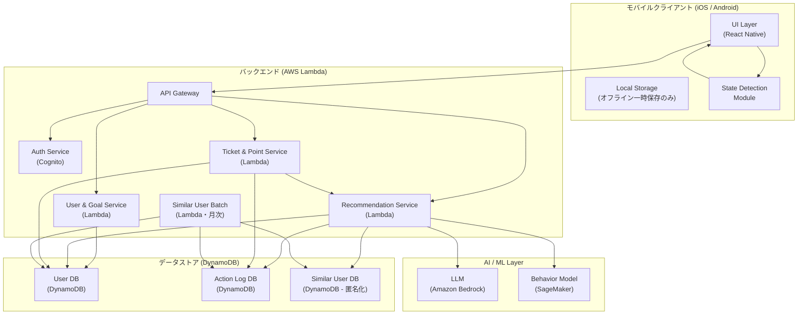
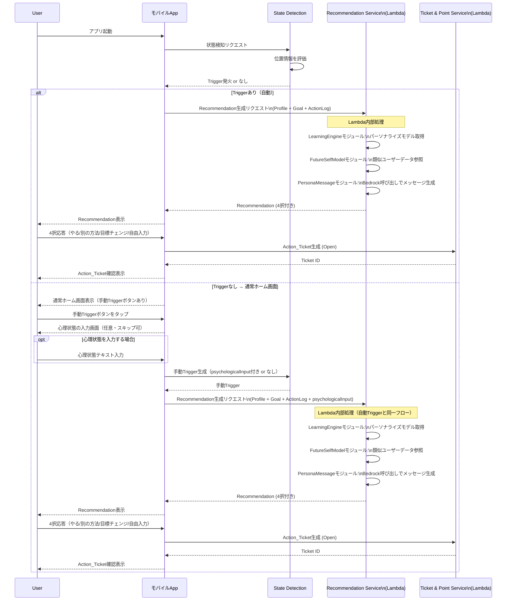
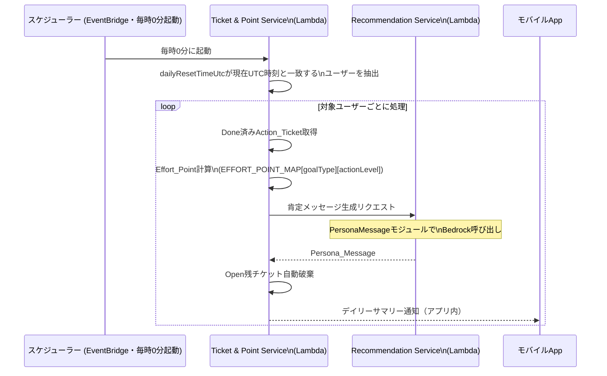
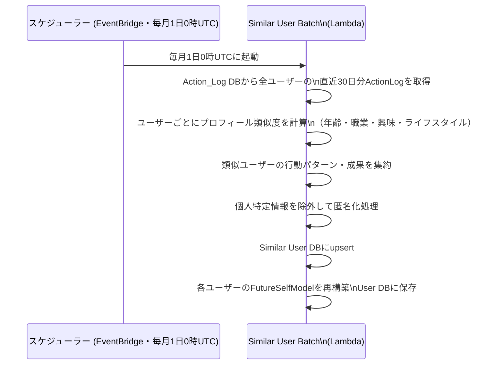
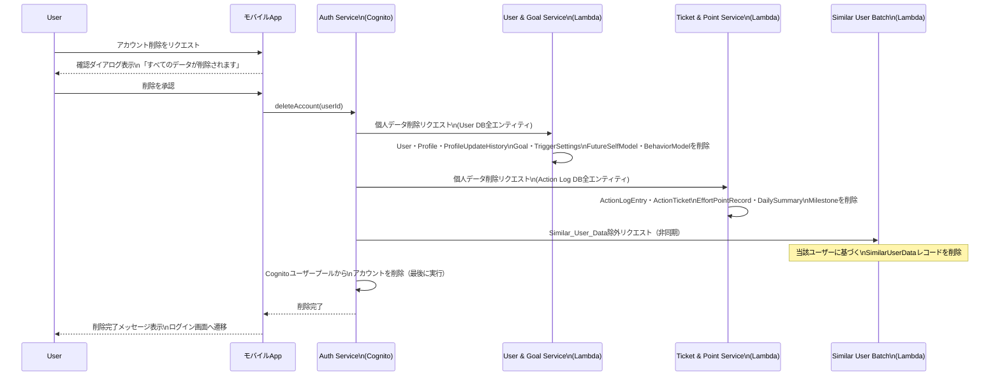
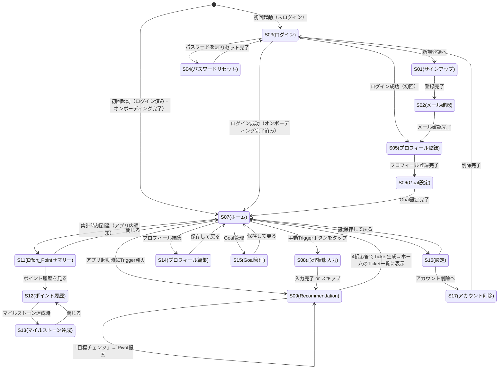

# 設計ドキュメント: だが、それでいい（DagaSoreDeIi_App）

## 概要

「だが、それでいい」は、ユーザーが「今日も何かできた」を見つけるための行動支援アプリケーションです。従来の習慣トラッカーが「一つの習慣をストイックに継続させる」ことを目的とするのに対し、本アプリは目標通りにできた日を最高としつつも、別のことができた日も十分に価値があると捉えます。

### 設計の基本方針

- **Flexible Achievement First**: 0点か100点かではなく、何かできた日はみんな合格点
- **AI-Driven Personalization**: ユーザーのProfile・Action_Log・Future_Self_Modelを組み合わせたパーソナライズ
- **Persona-Centric UX**: すべてのメッセージを「未来の自分」が語りかけるスタイルで統一
- **Progressive Learning**: Learning_Engineによる継続的な最適化
- **Privacy by Design**: センシティブデータの明示的同意と匿名化

### スコープ（v1）

- アプリ内表示のみ（プッシュ通知はv2以降）
- アプリ起動時のState_Detection（バックグラウンドトリガーはv2以降）
- モバイルアプリ（iOS / Android）

### 技術スタック

| レイヤー           | 技術                                                    |
| ------------------ | ------------------------------------------------------- |
| モバイル           | React Native + Expo + TypeScript                        |
| モバイルテスト     | Jest + React Native Testing Library + fast-check（PBT） |
| バックエンド       | TypeScript + Hono（AWS Lambda上で動作）                 |
| バックエンドテスト | Vitest + fast-check（PBT）                              |
| 認証               | Amazon Cognito                                          |
| API Gateway        | Amazon API Gateway                                      |
| データベース       | Amazon DynamoDB                                         |
| AI/LLM             | Amazon Bedrock                                          |
| MLモデル           | Amazon SageMaker                                        |
| スケジューラー     | Amazon EventBridge                                      |
| ローカルストレージ | expo-sqlite（SQLite）                                   |

---

## アーキテクチャ

### システム全体構成



### アプリ起動時のフロー



### 1日の終わりのフロー（Effort Point集計）



### 月次Similar_User_Dataバッチ処理フロー



**設計方針:**

- Recommendationの生成（リアルタイム）はUser DBに保存済みのFutureSelfModelを参照するため、バッチ処理の完了を待たない
- バッチ処理はFutureSelfModelの精度向上のみを担う（月1回の更新で十分）
- バッチ処理中にエラーが発生した場合は前月のFutureSelfModelをそのまま使用し続ける

---

### アカウント削除フロー



**削除処理の方針:**

- 全削除処理は72時間以内に完了する（GDPR・個人情報保護法準拠）
- 各サービスへの削除リクエストは順次実行し、いずれかが失敗した場合はリトライ（最大3回）
- Cognitoアカウントの削除は最後に実行する（途中失敗時の再試行を可能にするため）
- Similar_User_Dataの除外は非同期で実行し、完了を待たずにユーザーへ削除完了を通知する

---

## 画面遷移

### 画面一覧

| 画面ID | 画面名                       | 種別     | 概要                                                             |
| ------ | ---------------------------- | -------- | ---------------------------------------------------------------- |
| S01    | サインアップ画面             | 画面     | メール・パスワード入力で新規登録                                 |
| S02    | メール確認画面               | 画面     | 確認コード入力・再送信                                           |
| S03    | ログイン画面                 | 画面     | メール・パスワードでログイン                                     |
| S04    | パスワードリセット画面       | 画面     | リセットコード送信・新パスワード設定                             |
| S05    | プロフィール登録画面         | 画面     | 氏名・年齢・職業・興味・生活リズム・悩みを入力                   |
| S06    | Goal設定画面                 | 画面     | Goal登録・Primary_Goal指定                                       |
| S07    | ホーム画面                   | 画面     | 手動Triggerボタン・Open Ticket一覧・完了申告を統合したメイン画面 |
| S08    | 心理状態入力モーダル         | モーダル | 手動Trigger時の任意入力（スキップ可）                            |
| S09    | Recommendation画面           | 画面     | 提案表示・4択応答                                                |
| S11    | Effort_Pointサマリーモーダル | モーダル | 1日の終わりの集計・Persona_Message表示                           |
| S12    | ポイント履歴画面             | 画面     | 週間・月間グラフ・累計ポイント                                   |
| S13    | マイルストーン達成モーダル   | モーダル | バッジ・達成メッセージ表示                                       |
| S14    | プロフィール編集画面         | 画面     | Profile情報の編集・更新履歴閲覧                                  |
| S15    | Goal管理画面                 | 画面     | Goal追加・削除・Primary_Goal変更                                 |
| S16    | 設定画面                     | 画面     | Trigger設定・集計時刻・学習データリセット                        |
| S17    | アカウント削除画面           | 画面     | 削除確認・実行                                                   |

---

### 画面遷移図



---

### 共通型定義

design.md全体で使用する型エイリアスをここで一元定義する。

```typescript
// Goal種別：primary（Primary_Goal）/ pivot（Pivot_Goal）
type GoalType = "primary" | "pivot";

// 行動レベル：normal（通常行動）/ minimal（最低限行動）
type ActionLevel = "normal" | "minimal";

// Recommendation応答種別
type ResponseType = "do_it" | "alternative" | "goal_change" | "free_input";

// Effort_Pointポイントマップ
const EFFORT_POINT_MAP: Record<GoalType, Record<ActionLevel, number>> = {
  primary: { normal: 10, minimal: 5 },
  pivot: { normal: 7, minimal: 3 },
};
```

---

### 1. Auth Service（Amazon Cognito）

ユーザーの認証・アカウント管理を担当するサービス。Amazon Cognitoのユーザープールを使用し、メールアドレス＋パスワード認証を提供する。発行されたCognito `sub`（UUID）がシステム全体のユーザーIDとして使用される。

```typescript
interface AuthService {
  // 新規アカウント登録（メール確認メール送信）
  signUp(email: string, password: string): Promise<{ userId: string }>;

  // メールアドレス確認（確認コード入力）
  confirmSignUp(email: string, confirmationCode: string): Promise<void>;

  // 確認メール再送信
  resendConfirmationCode(email: string): Promise<void>;

  // ログイン（JWTトークン発行）
  signIn(email: string, password: string): Promise<AuthSession>;

  // パスワードリセット（リセットコード送信）
  forgotPassword(email: string): Promise<void>;

  // パスワードリセット確定（新パスワード設定）
  confirmForgotPassword(email: string, code: string, newPassword: string): Promise<void>;

  // アカウント削除（Cognitoユーザー削除 + 全個人データ削除）
  deleteAccount(userId: string): Promise<void>;

  // セッション取得（アプリ再起動時の自動ログイン）
  getCurrentSession(): Promise<AuthSession | null>;
}

interface AuthSession {
  userId: string; // Cognito sub（システム全体のユーザーID）
  email: string;
  accessToken: string;
  idToken: string;
  refreshToken: string;
  expiresAt: string; // ISO 8601
}
```

**認証フロー（オンボーディング）:**

1. メールアドレス＋パスワード入力 → Cognito `signUp`
2. 確認コード入力 → Cognito `confirmSignUp`
3. 自動ログイン → Cognito `signIn`
4. Profileオンボーディング（要件1）へ遷移

**ログイン失敗制限:** Cognitoのデフォルト機能（5回連続失敗でアカウントロック）を使用する。

---

### 2. User & Goal Service（Lambda）

ユーザーのプロフィール情報とGoalの管理を担当するLambda。User DBに対するCRUD操作を一元管理する。

```typescript
// --- Profile管理 ---
interface ProfileService {
  createProfile(userId: string, data: ProfileInput): Promise<Profile>;
  getProfile(userId: string): Promise<Profile>;
  updateProfile(userId: string, data: Partial<ProfileInput>): Promise<Profile>;
  autoUpdateProfile(userId: string, actionLog: ActionLog): Promise<Profile>;
  getUpdateHistory(userId: string): Promise<ProfileUpdateHistory[]>;
  analyzeBehaviorPattern(userId: string): Promise<BehaviorPattern>;
  isOnboardingComplete(userId: string): Promise<boolean>;
}

// --- Goal管理 ---
interface GoalService {
  createGoal(userId: string, data: GoalInput): Promise<Goal>;
  listGoals(userId: string): Promise<Goal[]>;
  updateGoal(userId: string, goalId: string, data: Partial<GoalInput>): Promise<Goal>;
  deleteGoal(userId: string, goalId: string, confirmed: boolean): Promise<void>;
  setPrimaryGoal(userId: string, goalId: string): Promise<Goal>;
  getPivotGoalCandidates(userId: string): Promise<Goal[]>;
  generateAIPivotCandidates(userId: string): Promise<AIPivotCandidate[]>;
}
```

### 3. State Detection Module（クライアントサイド）

アプリ起動時にユーザーの状態を検知し、Triggerを評価するモジュール。

```typescript
interface StateDetectionModule {
  // 状態検知実行（アプリ起動時）
  detectState(userId: string): Promise<DetectedState>;

  // Trigger評価
  evaluateTriggers(state: DetectedState, settings: TriggerSettings): Promise<Trigger | null>;

  // 位置情報取得（権限チェック付き）
  getLocationIfPermitted(): Promise<Location | null>;

  // 手動起動処理（心理状態の任意入力を受け付けてTrigger生成）
  handleManualTrigger(psychologicalInput?: string): Promise<Trigger>;

  // Triggerソース設定取得
  getTriggerSettings(userId: string): Promise<TriggerSettings>;

  // 複数Trigger優先度評価
  selectHighestPriorityTrigger(triggers: Trigger[]): Trigger;
}
```

### 3. Local Storage Module（クライアントサイド・SQLite）

オフライン時のAction_Ticket完了申告を一時保存し、オンライン復帰時にサーバーへ同期するモジュール。実装には**expo-sqlite**（React Native）を使用する。

```typescript
interface LocalStorageModule {
  // オフライン完了申告を保存
  savePendingCompletion(ticketId: string, completedAt: string): Promise<void>;

  // 未同期の完了申告を取得
  getPendingCompletions(): Promise<PendingCompletion[]>;

  // 同期完了後に削除
  removePendingCompletion(ticketId: string): Promise<void>;

  // オンライン復帰時に一括同期
  syncPendingCompletions(): Promise<SyncResult>;

  // 前回起動時の位置情報・タイムスタンプを保存（State Detection用）
  saveLastLaunchState(location: Location | null, detectedAt: string): Promise<void>;

  // 前回起動時の状態を取得
  getLastLaunchState(): Promise<LastLaunchState | null>;
}

interface PendingCompletion {
  ticketId: string;
  completedAt: string;
  savedAt: string;
}

interface LastLaunchState {
  location: Location | null;
  detectedAt: string;
}

interface SyncResult {
  synced: number;
  failed: number;
}
```

**オフライン時の挙動:**

- Action_Ticket完了申告：SQLiteに保存 → オンライン復帰時に自動同期
- 新規Action_Ticket作成（Recommendation応答）：オンライン必須。オフライン時は「接続が必要です」を表示
- 前回起動位置情報：SQLiteに保存（State Detectionの滞在判定に使用）

---

### 5. Recommendation Service（Lambda）

Triggerに基づいてRecommendationを生成するLambda。Learning Engine・Future Self Model・Persona Messageの3つのモジュールを内包し、Lambda間の連鎖呼び出しなしに1リクエスト内で完結する。

```typescript
// --- Recommendation Orchestrator ---
interface RecommendationService {
  // 初回Recommendation生成（Primary_Goal関連）
  generateInitialRecommendation(userId: string, trigger: Trigger): Promise<Recommendation>;

  // 同Goal内別アクション提案（「いいえ（別の方法で）」応答時）
  generateAlternativeAction(userId: string, currentGoalId: string): Promise<Recommendation>;

  // Pivot提案（「目標チェンジ」応答時）
  generatePivotRecommendation(userId: string): Promise<Recommendation>;

  // 最低限行動提案（Pivot後も拒否された場合）
  generateMinimalActionRecommendation(userId: string): Promise<Recommendation>;

  // 自由入力受付
  acceptFreeInput(userId: string, input: string): Promise<Recommendation>;

  // Persona_Message生成（Effort_Point集計・破棄通知など外部からの呼び出し用）
  generatePersonaMessage(userId: string, context: MessageContext): Promise<PersonaMessage>;
}

// --- Learning Engine モジュール（Lambda内部） ---
interface LearningEngineModule {
  // 行動モデル取得（7件以上蓄積後にパーソナライズ）
  getBehaviorModel(userId: string): Promise<BehaviorModel>;

  // 曜日・時間帯別達成率分析
  analyzeAchievementRate(userId: string): Promise<AchievementRateAnalysis>;

  // Pivot_Goal昇格提案チェック（応答率80%超）
  checkPivotGoalPromotion(userId: string): Promise<GoalPromotionSuggestion | null>;

  // Action_Log蓄積・Profile自動更新・Future_Self_Model更新
  recordAndUpdate(userId: string, log: ActionLogEntry): Promise<void>;

  // 学習データリセット（確認済み）
  resetLearningData(userId: string, confirmed: boolean): Promise<void>;
}

// --- Future Self Model モジュール（Lambda内部） ---
interface FutureSelfModelModule {
  // Future_Self_Model構築（Profile登録時）
  buildModel(userId: string, profile: Profile): Promise<FutureSelfModel>;

  // Future_Self_Model取得
  getModel(userId: string): Promise<FutureSelfModel>;

  // Similar_User_Data検索（類似プロフィール）
  findSimilarUsers(profile: Profile, minCount: number): Promise<SimilarUserData[]>;

  // モデル更新（Action_Log蓄積時）
  updateModel(userId: string, actionLog: ActionLog): Promise<FutureSelfModel>;

  // フォールバックモデル生成（類似ユーザー5件未満）
  buildFallbackModel(userId: string, profile: Profile, goals: Goal[]): Promise<FutureSelfModel>;
}

// --- Persona Message モジュール（Lambda内部・Bedrock呼び出し） ---
interface PersonaMessageModule {
  // Recommendation用メッセージ生成
  generateRecommendationMessage(recommendation: Recommendation, context: MessageContext): Promise<PersonaMessage>;

  // Effort_Point付与時メッセージ生成
  generateEffortPointMessage(result: EffortPointResult): Promise<PersonaMessage>;

  // Action_Ticket破棄時メッセージ生成
  generateDiscardMessage(discardResult: DiscardResult): Promise<PersonaMessage>;

  // Goal達成メッセージ生成
  generateAchievementMessage(goalType: GoalType, actionLevel: ActionLevel): Promise<PersonaMessage>;
}
```

````

### 6. Ticket & Point Service（Lambda）

Action_Ticketのライフサイクル管理とEffort_Pointの計算・付与・集計を担当するLambda。EventBridgeでスケジュール起動され、Persona_Message生成はRecommendation Serviceに委譲する。

```typescript
// --- Action Ticket管理 ---
interface ActionTicketService {
  createTicket(userId: string, data: ActionTicketInput): Promise<ActionTicket>;
  listOpenTickets(userId: string): Promise<ActionTicket[]>;
  completeTicket(userId: string, ticketId: string): Promise<ActionTicket>;
  discardExpiredTickets(userId: string, date: string): Promise<DiscardResult>;
  getDiscardedTicketHistory(userId: string): Promise<ActionTicket[]>;
  getDoneTicketsByDate(userId: string, date: string): Promise<ActionTicket[]>;
}

// --- Effort Point管理 ---
interface EffortPointService {
  calculateAndAwardPoints(userId: string, date: string): Promise<EffortPointResult>;
  getTotalPoints(userId: string): Promise<number>;
  getPointHistory(userId: string, period: 'weekly' | 'monthly'): Promise<PointHistory>;
  setDailyResetTime(userId: string, time: string): Promise<void>;
  checkMilestone(userId: string, newTotal: number): Promise<Milestone | null>;
}
````

---

## データモデル

### User / Profile

```typescript
interface User {
  userId: string; // Cognito sub（UUID）
  email: string;
  emailVerified: boolean; // メールアドレス確認済みフラグ
  createdAt: string; // ISO 8601
  updatedAt: string;
  timezoneOffset: number; // UTCオフセット（分）例：JST=+540, PST=-480
  dailyResetTimeUtc: number; // 集計UTC時刻（0〜23の整数）。ユーザー設定時刻をUTC変換して保存
  consentGiven: boolean; // Similar_User_Data利用同意
  sensitiveDataConsent: {
    location: boolean;
    screenTime: boolean;
  };
}

interface Profile {
  userId: string;
  name: string;
  age: number;
  occupation: string;
  interests: string[]; // 興味分野（複数）
  lifestyleType: "morning" | "night" | "flexible"; // 朝型/夜型/フレキシブル
  currentConcerns: string[]; // 現在の悩み（複数）
  behaviorTendencyScore: BehaviorTendencyScore;
  behaviorPattern: BehaviorPattern | null; // 過去30日分析結果
  onboardingCompleted: boolean;
  createdAt: string;
  updatedAt: string;
}

interface BehaviorTendencyScore {
  consistency: number; // 継続性スコア (0-100)
  pivotFrequency: number; // Pivot頻度スコア (0-100)
  morningActivity: number; // 朝の活動スコア (0-100)
  eveningActivity: number; // 夜の活動スコア (0-100)
}

interface BehaviorPattern {
  strongPatterns: string[]; // 得意な行動パターン
  analyzedAt: string;
  basedOnDays: number; // 分析対象日数（最大30）
}

interface ProfileUpdateHistory {
  historyId: string;
  userId: string;
  changedFields: string[];
  previousValues: Record<string, unknown>;
  newValues: Record<string, unknown>;
  updatedAt: string;
  updateSource: "manual" | "learning_engine";
}
```

### Goal

```typescript
interface Goal {
  goalId: string; // UUID
  userId: string;
  title: string; // 例：「英語を習慣的にやりたい」
  description: string;
  goalType: "primary" | "pivot";
  isPrimary: boolean;
  createdAt: string;
  updatedAt: string;
  deletedAt: string | null;
}

interface AIPivotCandidate {
  title: string;
  description: string;
  basedOnProfileField: string; // 参照したProfileフィールド
  confidence: number; // 提案信頼度 (0-1)
}
```

### State Detection / Trigger

```typescript
interface DetectedState {
  userId: string;
  detectedAt: string;
  location: Location | null;
  previousLocation: Location | null; // 前回起動時の位置情報
  previousDetectedAt: string | null; // 前回起動時のタイムスタンプ
  elapsedMinutesSinceLastLaunch: number | null; // 前回起動からの経過時間（分）
  isStationary: boolean | null; // 移動していない（同一位置滞在中）と判定されたか
  psychologicalInput: string | null; // 手動起動時の任意入力
  triggerSource: "app_launch" | "manual";
}

interface Location {
  latitude: number;
  longitude: number;
}

interface Trigger {
  triggerId: string;
  triggerType: "long_stay_stationary" | "manual"; // long_stay_home → long_stay_stationary に変更
  priority: number; // 優先度（高いほど優先）
  detectedAt: string;
  psychologicalInput: string | null; // 手動起動時の任意入力（Persona_Messageパーソナライズに使用）
  sourceData: Record<string, unknown>;
}

interface TriggerSettings {
  userId: string;
  locationEnabled: boolean;
  manualEnabled: boolean;
  updatedAt: string;
}
```

### Recommendation

```typescript
interface Recommendation {
  recommendationId: string;
  userId: string;
  triggerId: string;
  goalId: string;
  goalType: GoalType; // 共通型定義参照
  actionLevel: ActionLevel; // 共通型定義参照
  actionDescription: string; // 提案内容
  personaMessage: PersonaMessage;
  createdAt: string;
  respondedAt: string | null;
  response: ResponseType | null;
}

// 4択はクライアント側定数として定義（サーバーから返却しない）
const RESPONSE_OPTIONS: ResponseOption[] = [
  { type: "do_it", label: "やる" },
  { type: "alternative", label: "いいえ（別の方法で）" },
  { type: "goal_change", label: "目標チェンジ" },
  { type: "free_input", label: "自由入力" },
];

interface ResponseOption {
  type: ResponseType;
  label: string;
}

interface PersonaMessage {
  messageId: string;
  content: string; // 生成されたメッセージ本文
  tone: "encouragement" | "praise" | "pivot_acceptance" | "minimal_push";
  generatedAt: string;
}
```

### Action Ticket

```typescript
interface ActionTicket {
  ticketId: string;
  userId: string;
  recommendationId: string | null; // 自由入力の場合はnull
  goalId: string;
  goalType: GoalType; // 共通型定義参照
  actionLevel: ActionLevel; // 共通型定義参照
  actionDescription: string;
  status: "open" | "done" | "discarded";
  createdAt: string;
  completedAt: string | null;
  discardedAt: string | null;
}

interface DiscardResult {
  discardedTickets: ActionTicket[];
  doneTickets: ActionTicket[];
  discardMessage: PersonaMessage;
}
```

### Effort Point

```typescript
interface EffortPointRecord {
  recordId: string;
  userId: string;
  ticketId: string; // Action_Ticketと1対1で紐付く
  goalType: GoalType; // 共通型定義参照
  actionLevel: ActionLevel; // 共通型定義参照
  pointsAwarded: number; // EFFORT_POINT_MAP[goalType][actionLevel] で決定
  date: string; // YYYY-MM-DD
  cumulativeTotal: number;
  personaMessage: PersonaMessage;
  awardedAt: string;
}

interface DailySummary {
  userId: string;
  date: string; // YYYY-MM-DD
  totalDayPoints: number; // その日の合計ポイント
  summarizedAt: string; // 1日の終わりの集計タイムスタンプ
}

interface PointHistory {
  userId: string;
  period: "weekly" | "monthly";
  dataPoints: { date: string; points: number }[];
  totalInPeriod: number;
}

interface Milestone {
  milestoneId: string;
  userId: string;
  totalPoints: number; // 100の倍数
  badgeType: string;
  achievedAt: string;
}
```

### Action Log

```typescript
interface ActionLogEntry {
  logId: string;
  userId: string;
  ticketId: string;
  goalId: string;
  goalType: GoalType; // 共通型定義参照
  actionLevel: ActionLevel; // 共通型定義参照
  actionDescription: string;
  responseType: ResponseType;
  completedAt: string;
  dayOfWeek: number; // 0=日曜, 6=土曜
  hourOfDay: number; // 0-23
}
```

### Future Self Model / Similar User Data

```typescript
interface FutureSelfModel {
  modelId: string;
  userId: string;
  basedOnSimilarUsers: number; // 参照した類似ユーザー数
  isFallback: boolean; // 5件未満の場合true
  successStories: SuccessStory[];
  updatedAt: string;
}

interface SuccessStory {
  storyId: string;
  goalCategory: string;
  timeframeMonths: number;
  outcomeDescription: string; // 「筋トレを始めて3ヶ月でこうなった」
  similarityScore: number; // 類似度スコア (0-1)
}

interface SimilarUserData {
  anonymizedId: string; // 個人特定不可の匿名ID
  profileSimilarityScore: number;
  goalCategories: string[];
  actionPatterns: string[];
  outcomes: string[];
  dataCollectedAt: string;
}

interface BehaviorModel {
  modelId: string;
  userId: string;
  isPersonalized: boolean; // 7件以上蓄積でtrue
  achievementRateByDayHour: Record<string, number>; // "Mon-09": 0.8
  preferredGoalTypes: string[];
  pivotGoalResponseRates: Record<string, number>; // goalId: rate
  updatedAt: string;
}
```

---

## DynamoDB テーブル設計

DynamoDBはアクセスパターン駆動で設計する。以下に各テーブルのPK・SK・GSIと主要クエリパターンを定義する。

---

### User DB

**テーブル名**: `Users`

| 属性     | 役割 | 型     |
| -------- | ---- | ------ |
| `userId` | PK   | String |

**格納エンティティ**: User・Profile・ProfileUpdateHistory・Goal・TriggerSettings・FutureSelfModel・BehaviorModel

単一テーブル設計（Single Table Design）を採用し、`entityType`属性でエンティティを区別する。

| entityType          | SK                    | 用途                      |
| ------------------- | --------------------- | ------------------------- |
| `USER`              | `USER`                | Userレコード              |
| `PROFILE`           | `PROFILE`             | Profileレコード           |
| `PROFILE_HISTORY`   | `HISTORY#<updatedAt>` | Profile更新履歴（時系列） |
| `GOAL`              | `GOAL#<goalId>`       | Goalレコード              |
| `TRIGGER_SETTINGS`  | `TRIGGER_SETTINGS`    | Trigger設定               |
| `FUTURE_SELF_MODEL` | `FUTURE_SELF_MODEL`   | FutureSelfModel           |
| `BEHAVIOR_MODEL`    | `BEHAVIOR_MODEL`      | BehaviorModel             |

**GSI**:

| GSI名            | PK                  | SK       | 用途                                            |
| ---------------- | ------------------- | -------- | ----------------------------------------------- |
| `GSI-DailyReset` | `dailyResetTimeUtc` | `userId` | EventBridge集計時に対象ユーザーを時刻で絞り込む |

---

### Action Log DB

**テーブル名**: `ActionLogs`

| 属性          | 役割 | 型                 |
| ------------- | ---- | ------------------ |
| `userId`      | PK   | String             |
| `completedAt` | SK   | String（ISO 8601） |

**格納エンティティ**: ActionLogEntry・ActionTicket・EffortPointRecord・DailySummary・Milestone

| entityType      | SK                              | 用途                        |
| --------------- | ------------------------------- | --------------------------- |
| `ACTION_LOG`    | `LOG#<completedAt>`             | ActionLogEntry（時系列）    |
| `TICKET`        | `TICKET#<createdAt>#<ticketId>` | ActionTicket                |
| `EFFORT_POINT`  | `POINT#<awardedAt>`             | EffortPointRecord（時系列） |
| `DAILY_SUMMARY` | `SUMMARY#<date>`                | DailySummary（日次）        |
| `MILESTONE`     | `MILESTONE#<achievedAt>`        | Milestone                   |

**主要クエリパターンと対応するアクセス方法**:

| クエリ                             | アクセス方法                                               |
| ---------------------------------- | ---------------------------------------------------------- |
| ユーザーの過去30日のAction_Log取得 | PK=userId, SK begins_with `LOG#`, フィルタで日付範囲指定   |
| 特定日のDone済みAction_Ticket取得  | PK=userId, SK begins_with `TICKET#<date>`                  |
| Open状態のAction_Ticket一覧        | PK=userId, SK begins_with `TICKET#`, フィルタ status=open  |
| 週間・月間のEffort_Point履歴       | PK=userId, SK begins_with `POINT#`, 期間フィルタ           |
| 曜日・時間帯別達成率分析           | PK=userId, SK begins_with `LOG#`, 全件取得後Lambda内で集計 |

**GSI**:

| GSI名                | PK         | SK       | 用途                                         |
| -------------------- | ---------- | -------- | -------------------------------------------- |
| `GSI-TicketByStatus` | `userId`   | `status` | Open/Done/Discardedでチケットを絞り込む      |
| `GSI-TicketById`     | `ticketId` | `userId` | ticketIdから直接チケットを取得（完了申告時） |

---

### Similar User DB

**テーブル名**: `SimilarUsers`

| 属性           | 役割 | 型     |
| -------------- | ---- | ------ |
| `anonymizedId` | PK   | String |
| `goalCategory` | SK   | String |

**GSI**:

| GSI名                | PK             | SK                       | 用途                                             |
| -------------------- | -------------- | ------------------------ | ------------------------------------------------ |
| `GSI-ByGoalCategory` | `goalCategory` | `profileSimilarityScore` | 同じゴールカテゴリの類似ユーザーを類似度順に取得 |

---

## 正確性プロパティ（Correctness Properties）

_プロパティとは、システムのすべての有効な実行において真であるべき特性または振る舞いです。つまり、システムが何をすべきかについての形式的な記述です。プロパティは、人間が読める仕様と機械で検証可能な正確性保証の橋渡しとなります。_

### Property 1: Profile登録時のPivot_Goal候補自動生成

_For any_ 有効なProfileが登録されたとき、システムは必ず3件以上のPivot_Goal候補を自動生成しなければならない

**Validates: Requirements 1.3**

---

### Property 2: 未完了Profileの欠損フィールド検出

_For any_ 必須フィールドの一部が欠けた不完全なProfile入力に対して、システムはすべての未入力フィールドを正確に特定して報告しなければならない

**Validates: Requirements 1.5**

---

### Property 3: Primary_Goal設定の一意性

_For any_ ユーザーのGoal一覧において、1件をPrimary_Goalとして設定した後は、必ずちょうど1件のGoalのみがisPrimary=trueとなっていなければならない

**Validates: Requirements 2.2**

---

### Property 4: Pivot_Goal候補の完全性

_For any_ Primary_Goalが設定されたGoal一覧において、Primary_Goal以外のすべてのGoalがPivot_Goal候補として分類されていなければならない

**Validates: Requirements 2.3**

---

### Property 5: 長時間滞在Triggerの閾値

_For any_ アプリ起動時において、前回起動からの経過時間が120分以上かつisStationary=trueの場合は「長時間滞在」Triggerが発火し、いずれかの条件を満たさない場合は発火しないという関係が成立しなければならない

**Validates: Requirements 3.3**

---

### Property 6: 複数Trigger発火時の優先度選択

_For any_ 同時に発火した複数のTriggerの集合において、選択されるTriggerはちょうど1件であり、かつその集合の中で最も高い優先度を持つTriggerでなければならない

**Validates: Requirements 3.7**

---

### Property 7: 初回RecommendationとPrimary_Goalの関連性

_For any_ Primary_Goalが設定されたユーザーに対して、Triggerが発火したときに生成される初回Recommendationは、必ずそのPrimary_Goalに関連した行動提案でなければならない

**Validates: Requirements 4.2**

---

### Property 8: Recommendation応答によるAction_Ticket生成

_For any_ Recommendationへの有効な応答（やる/いいえ（別の方法で）/目標チェンジ/自由入力）に対して、行動内容・対象Goal・生成日時を含むAction_TicketがOpen（未完了）ステータスで生成されなければならない

**Validates: Requirements 4.4, 5.6, 12.1**

---

### Property 9: Action_Ticket完了のAction_Log記録

_For any_ Action_TicketがDoneに更新されたとき、完了日時が記録され、かつAction_Logに対応するエントリが追加されていなければならない

**Validates: Requirements 5.9, 12.3**

---

### Property 10: Pivot提案のPersona_Messageスタイル

_For any_ Pivot提案（Pivot_Goal・最低限行動を含む）において、メッセージは必ずFuture_Self_ModelのPersona_Messageスタイル（一人称「俺/私」、二人称「お前/あなた」の口語体）で生成されなければならない

**Validates: Requirements 5.3, 9.1, 9.2**

---

### Property 11: Goal完了によるProfile行動傾向スコア更新

_For any_ いずれかのGoalに関連する行動が完了したとき、ProfileのbehaviorTendencyScoreが更新されていなければならない

**Validates: Requirements 6.1**

---

### Property 12: Pivot_Goal昇格提案の閾値

_For any_ Pivot_Goalに対して、連続3日以上の完了記録がある場合、**または**そのPivot_Goalへの応答率が80%を超えた場合、Learning_EngineはそのゴールをPrimary_Goal候補として昇格提案しなければならない

**Validates: Requirements 6.2, 10.3**

---

### Property 13: Effort_PointのgoalType×actionLevel別計算

_For any_ Done済みAction_Ticketの集合において、goalType=primary/actionLevel=normalには10ポイント、goalType=primary/actionLevel=minimalには5ポイント、goalType=pivot/actionLevel=normalには7ポイント、goalType=pivot/actionLevel=minimalには3ポイントが正確に付与されなければならない

**Validates: Requirements 7.1, 7.2**

---

### Property 14: マイルストーン達成の検出

_For any_ 累計Effort_Pointが100の倍数に達したとき、特別な達成メッセージとバッジが生成されなければならない

**Validates: Requirements 7.7**

---

### Property 15: Future_Self_Model構築

_For any_ 登録されたProfileに対して、Similar_User_Dataを参照してFuture_Self_Modelが構築されなければならない（類似ユーザーが5件未満の場合はフォールバックモデルを使用）

**Validates: Requirements 8.2, 8.7**

---

### Property 16: Similar_User_Dataの匿名性

_For any_ Similar_User_Dataとして収集されたレコードは、氏名・メールアドレス・電話番号などの個人を特定できる情報フィールドを含んではならない

**Validates: Requirements 8.6**

---

### Property 17: Action_Log蓄積によるFuture_Self_Model更新

_For any_ 新しいAction_Logエントリが追加されたとき、対応するFuture_Self_ModelのupdatedAtタイムスタンプが更新されていなければならない

**Validates: Requirements 8.4**

---

### Property 18: Learning_Engineのパーソナライズ切り替え

_For any_ ユーザーのAction_Logが7件以上蓄積されたとき、BehaviorModelのisPersonalizedフラグがtrueになっていなければならない

**Validates: Requirements 10.2**

---

### Property 19: 時間帯別達成率の正確な分析

_For any_ Action_Logデータセットにおいて、曜日・時間帯ごとの達成率分析は、各スロットの完了数/試行数の比率を正確に反映していなければならない

**Validates: Requirements 10.3**

---

### Property 20: 1日の終わりのOpen_Ticket自動破棄

_For any_ 日次集計タイミングにおいてOpenステータスのまま残っているAction_Ticketは、すべてdiscardedステータスに遷移しなければならない

**Validates: Requirements 12.4**

---

## エラーハンドリング

### 認証エラー

- ログイン失敗時はCognitoのエラーコードに基づいて「メールアドレスまたはパスワードが正しくありません」という汎用メッセージを表示する（セキュリティのため、どちらが間違いかは明示しない）
- メール未確認状態でのログイン試行時は確認メール再送信オプションを提示する
- アクセストークン期限切れ時はリフレッシュトークンで自動更新し、リフレッシュトークンも期限切れの場合はログイン画面にリダイレクトする

### 位置情報権限拒否

- 位置情報の取得権限が拒否された場合、位置情報Triggerを無効化し、手動起動Triggerのみで動作を継続する
- ユーザーには権限が拒否されている旨を通知し、設定変更を促すオプションを提示する

### Profile未完了状態

- オンボーディング未完了のユーザーがメイン機能にアクセスしようとした場合、未入力フィールドを明示してオンボーディング画面にリダイレクトする
- 部分的に入力されたProfileデータは保存し、再開時に引き継ぐ

### Similar_User_Data不足

- 類似ユーザーが5件未満の場合、フォールバックモデル（ProfileとGoalのみに基づく推定）を使用する
- フォールバックモデル使用中であることをシステム内部でフラグ管理し、データが蓄積され次第自動的に通常モデルに切り替える

### AI/LLM呼び出し失敗

- Persona_Message生成のためのLLM呼び出しが失敗した場合、事前定義されたテンプレートメッセージにフォールバックする
- テンプレートメッセージもPersona_Messageのトーン（一人称「俺/私」、二人称「お前/あなた」）を維持する
- エラーはログに記録し、リトライ（最大3回、指数バックオフ）を実施する

### Pivot_Goal候補なし

- 「目標チェンジ」選択時にPivot_Goal候補が存在しない場合、ProfileのinterestsとlifestyleTypeとcurrentConcernsを参照してAIが即席のPivot候補を生成する
- AI生成も失敗した場合、最低限の行動（「5分だけ外の空気を吸いに行く」等）を提案する

### 学習データリセット

- リセット操作は確認ダイアログを必須とし、誤操作を防ぐ
- リセット後はAction_LogとBehaviorModelをクリアし、isPersonalized=falseに戻す
- Future_Self_Modelはリセット対象外（Similar_User_Dataに基づくため）

### ネットワーク障害

- オフライン時はAction_Ticketの完了申告をSQLite（expo-sqlite）に保存し、オンライン復帰時にDynamoDBへ自動同期する
- 新規Action_Ticketの作成（Recommendation応答）はオンライン必須。オフライン時は「インターネット接続が必要です」を表示する
- Recommendationの生成はオンライン必須とし、オフライン時はキャッシュされた最後のRecommendationを表示するか、接続を促すメッセージを表示する
- Profile・Goal・Action_Logなどのマスターデータは常にDynamoDB（User DB / Action Log DB）が正とする

### EventBridgeタイムゾーン処理

- 集計時刻はユーザーが**0時〜23時の整数時刻（1時間単位）**で設定する（デフォルト：0時）
- EventBridgeは**毎時0分**に固定起動（`cron(0 * * * ? *)`）
- Lambda側でUser DBを参照し、`dailyResetTimeUtc`が現在のUTC時刻（時）と一致するユーザーを抽出して処理する
- ユーザーが集計時刻を変更した場合、設定時刻とタイムゾーンオフセットからUTC時刻を再計算して`dailyResetTimeUtc`を更新する（EventBridgeの設定変更は不要）
- タイムゾーン情報はProfile登録時にデバイスのロケールから自動取得し、`timezoneOffset`に保存する

---

## テスト戦略

### 概要

本アプリはビジネスロジック（ポイント計算・Trigger評価・Goal分類・Learning_Engine）とAI/LLM連携の両方を含むため、**ユニットテスト**・**プロパティベーステスト**・**統合テスト**の3層アプローチを採用します。

### ユニットテスト

純粋な関数・ビジネスロジックに対して具体的な例を用いてテストします。

**対象コンポーネント:**

- Effort_Point計算ロジック（ゴール種別ごとのポイント値）
- Trigger優先度選択ロジック
- Profile完全性チェック
- Action_Ticketステータス遷移
- BehaviorModel達成率計算

**フレームワーク:** Jest + React Native Testing Library（モバイル）/ Vitest（バックエンド）

**方針:**

- 具体的な例・エッジケース・エラー条件に集中
- プロパティベーステストでカバーされる入力範囲はユニットテストで重複させない
- 各コンポーネントのモック境界を明確に定義する

### プロパティベーステスト（PBT）

上記の Correctness Properties セクションで定義した20のプロパティを、プロパティベーステストとして実装します。

**フレームワーク:**

- TypeScript（モバイル・バックエンド共通）: `fast-check`

**設定:**

- 各プロパティテストは最低100回のイテレーションを実行する
- 各テストには以下の形式でタグを付与する:
  ```
  // Feature: anti-habit-app, Property {番号}: {プロパティのタイトル}
  ```

**ジェネレーター設計:**

- `arbitraryProfile`: 有効なProfile（必須フィールドすべて含む）を生成
- `arbitraryIncompleteProfile`: ランダムなフィールドが欠けたProfileを生成
- `arbitraryGoalList`: 1件以上のGoalリスト（Primary_Goal含む）を生成
- `arbitraryActionTicketSet`: 様々なゴール種別のDone済みチケット集合を生成
- `arbitraryActionLogDataset`: 曜日・時間帯・ゴール種別が多様なAction_Logデータセットを生成
- `arbitraryTriggerSet`: 優先度が異なる複数のTriggerを生成

**重点プロパティ（優先実装）:**

1. Property 8: Recommendation応答によるAction_Ticket生成（コアフロー）
2. Property 13: Effort_Pointのゴール種別別計算（報酬システム）
3. Property 3: Primary_Goal設定の一意性（データ整合性）
4. Property 6: 複数Trigger発火時の優先度選択（State Detection）
5. Property 20: 1日の終わりのOpen_Ticket自動破棄（ライフサイクル）

### 統合テスト

外部サービス（Amazon Bedrock、DynamoDB、EventBridge）との連携を検証します。

**対象:**

- LLM（Amazon Bedrock）呼び出しとPersona_Message生成
- DynamoDBへのデータ永続化と取得
- EventBridgeによる日次集計スケジューリング
- Cognito認証フロー

**方針:**

- 1〜3件の代表的な例でテスト（PBTは不適切）
- テスト環境ではLocalStackまたはAWSテストアカウントを使用
- 外部サービスのモックはユニットテスト・PBTのみで使用

### スモークテスト

- 位置情報権限設定の確認
- Similar_User_Data収集の匿名化設定確認
- EventBridgeスケジューラーの設定確認

### テストカバレッジ目標

| レイヤー               | カバレッジ目標                                      |
| ---------------------- | --------------------------------------------------- |
| ユニットテスト         | 80%以上（ビジネスロジック）                         |
| プロパティベーステスト | 全20プロパティ実装                                  |
| 統合テスト             | 主要フロー（起動→Recommendation→Ticket→Point）のE2E |
