# コンポーネント依存関係 — だが、それでいい（DagaSoreDeIi_App）

## 概要

本ドキュメントは各コンポーネント間の依存関係と、主要ユースケースのデータフローを定義する。  
「どのコンポーネントが何に依存しているか」「あるユースケースでデータがどう流れるか」を確認したいときに参照する。  
コンポーネントの責務定義は [components.md](./components.md)、アーキテクチャ全体像は [application-design.md](./application-design.md) を参照。

## 目次

- [概要](#概要)
- [目次](#目次)
- [依存関係マトリクス](#依存関係マトリクス)
- [データフロー図](#データフロー図)
  - [1. 初期起動フロー（新規ユーザー）](#1-初期起動フロー新規ユーザー)
  - [2. アプリ起動フロー（既存ユーザー）](#2-アプリ起動フロー既存ユーザー)
  - [3. Recommendation生成フロー](#3-recommendation生成フロー)
  - [4. Done申告フロー](#4-done申告フロー)
  - [5. 日次集計・自動破棄フロー](#5-日次集計自動破棄フロー)
  - [6. 週次バッチフロー](#6-週次バッチフロー)
  - [7. Stats・サマリー表示フロー](#7-statsサマリー表示フロー)
  - [8. アカウント削除フロー](#8-アカウント削除フロー)
  - [9. PivotGoal 昇格提案フロー（FR-07-2）](#9-pivot_goal-昇格提案フローfr-07-2)
  - [10. 破棄メッセージ表示フロー（FR-13-5）](#10-破棄メッセージ表示フローfr-13-5)
  - [11. 学習データリセットフロー（FR-11-3）](#11-学習データリセットフローfr-11-3)
- [通信パターン](#通信パターン)
- [循環依存の排除](#循環依存の排除)

---

## 依存関係マトリクス

| コンポーネント                  | 依存先                                                                                          |
| ------------------------ | -------------------------------------------------------------------------------------------- |
| Amplify UI Authenticator | AWS Cognito User Pool（外部ライブラリがカプセル化）                                                         |
| OnboardingScreens        | ProfileService, GoalService, NavigationComponent                                             |
| HomeScreen               | TriggerService, ActionTicketService, StatsService, GoalService（昇格候補）, authStore, ticketStore |
| RecommendationScreens    | RecommendationService, ActionTicketService, recommendationStore, ticketStore                 |
| ActionTicketScreens      | ActionTicketService, ticketStore                                                             |
| ProfileScreens           | ProfileService, GoalService, AccountService（アカウント削除）, Amplify `useAuthenticator`（サインアウト）     |
| StatsScreens             | StatsService                                                                                 |
| AccountService           | APIClient                                                                                    |
| ProfileService           | APIClient                                                                                    |
| GoalService              | APIClient                                                                                    |
| TriggerService           | APIClient, ActionTicketService（内部で getOpenTickets 参照）, ticketStore                           |
| RecommendationService    | APIClient, recommendationStore, ticketStore                                                  |
| ActionTicketService      | APIClient, ticketStore                                                                       |
| StatsService             | APIClient                                                                                    |
| APIClient                | AWS Amplify Auth（`fetchAuthSession` による JWT 取得）                                              |
| AccountLambda            | UserDB, ActionLogDB, CognitoUserPool（SimilarUserDBは匿名化済みのため削除対象外）                            |
| UserLambda               | UserDB, ActionLogDB（学習データリセット時のActionLogEntry削除）, BedrockClient, BackendErrorHandler                                                   |
| ActionTicketLambda       | ActionLogDB, UserDB, BedrockClient, BackendErrorHandler                                      |
| RecommendationLambda     | UserDB, ActionLogDB, SimilarUserDB, BedrockClient, BackendErrorHandler                       |
| DailyAggregationLambda   | ActionLogDB, UserDB, BedrockClient, BackendErrorHandler                                      |
| StatsLambda              | ActionLogDB, BackendErrorHandler                                                             |
| LearningEngineLambda     | UserDB, ActionLogDB, BedrockClient, BackendErrorHandler                                      |
| EventBridgeScheduler     | DailyAggregationLambda（毎日0時）, LearningEngineLambda（毎週月曜0時）                                   |

**Note（Zustandストア）**: マトリクスでは Application Design で確定した3ストア（`authStore` / `ticketStore` / `recommendationStore`）のみを記載する。`profileStore` / `goalStore` / `effortPointStore` は Construction Phase で Zustand か React Query キャッシュかを決定するため未記載。

**Note（認証）**: サインアップ・サインイン・パスワードリセット・メール確認は Amplify UI Authenticator が一括提供する。各画面は `useAuthenticator` フックで認証情報にアクセスできる。

---

## データフロー図

### 1. 初期起動フロー（新規ユーザー）

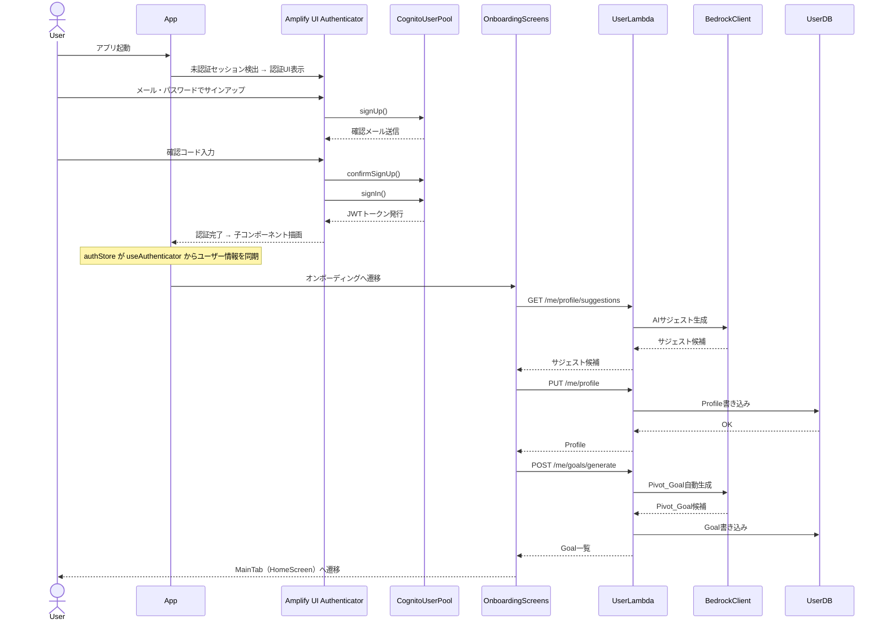

1. FR-09-5「Similar_User_Data収集の同意UI」の画面配置が未定義

### 2. アプリ起動フロー（既存ユーザー）

自動Triggerの実行主体は HomeScreen とする（`TriggerService.checkAutoTrigger` は HomeScreen 内で呼ばれる）。認証セッションの検証は Amplify UI Authenticator が透過的に実施する。

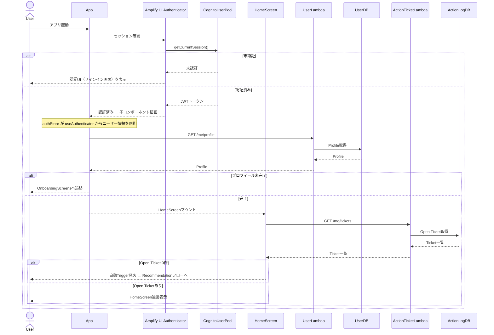

### 3. Recommendation生成フロー

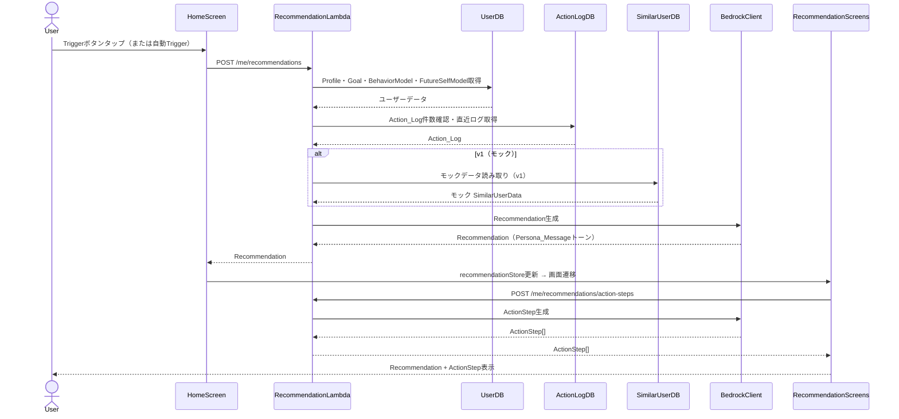

### 4. Done申告フロー

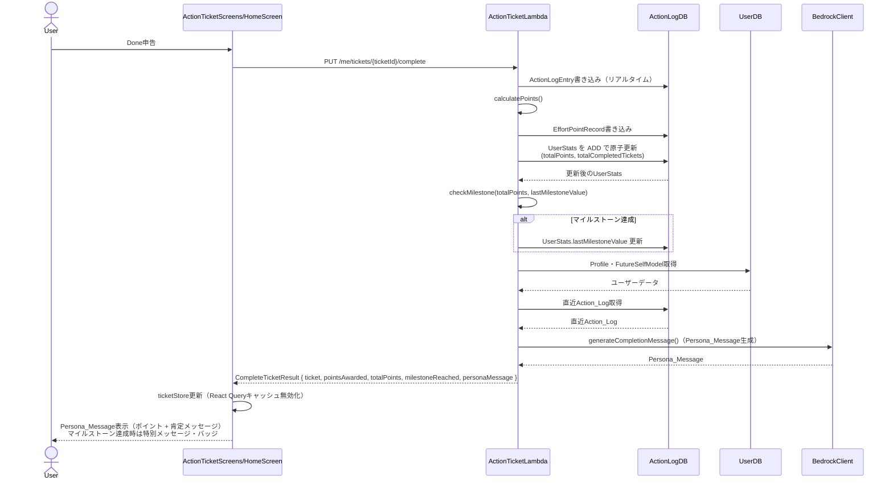

### 5. 日次集計・自動破棄フロー

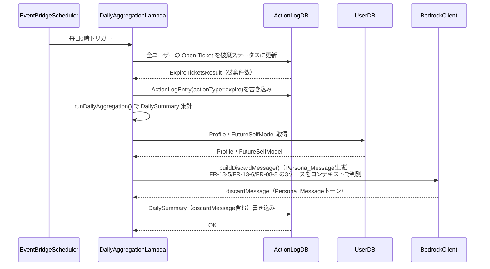

### 6. 週次バッチフロー

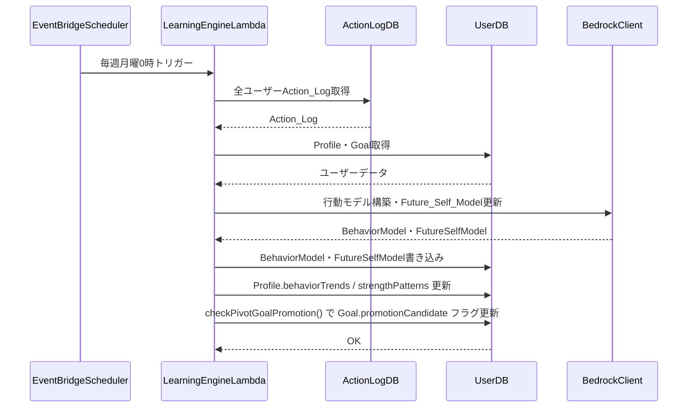

### 7. Stats・サマリー表示フロー

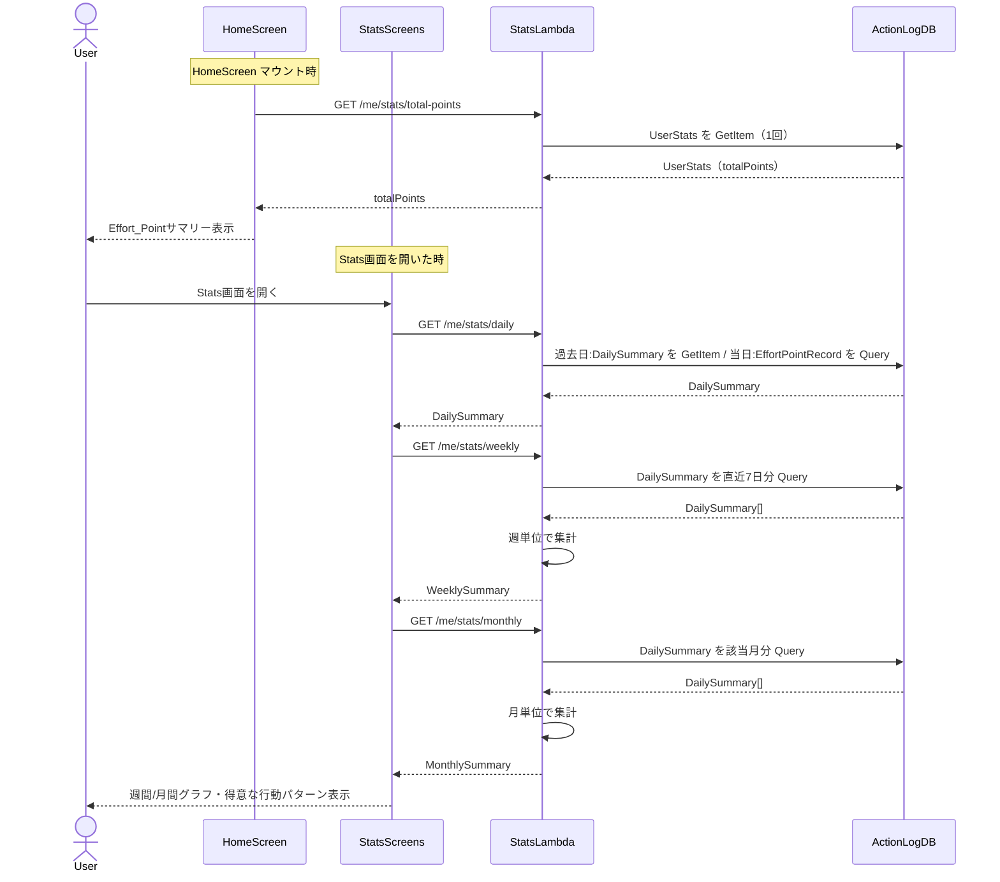

### 8. アカウント削除フロー

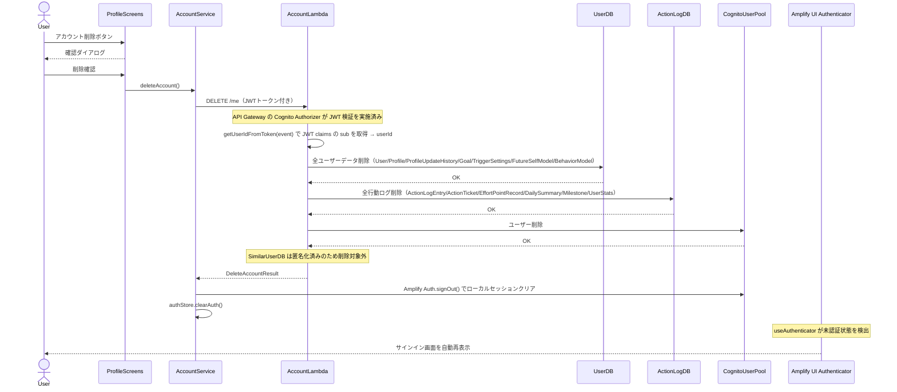

### 9. Pivot_Goal 昇格提案フロー（FR-07-2）

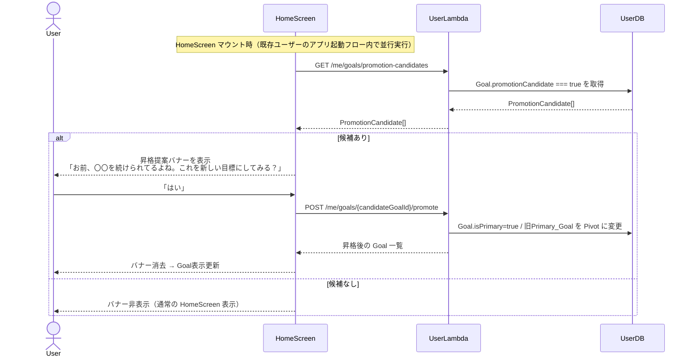

### 10. 破棄メッセージ表示フロー（FR-13-5）

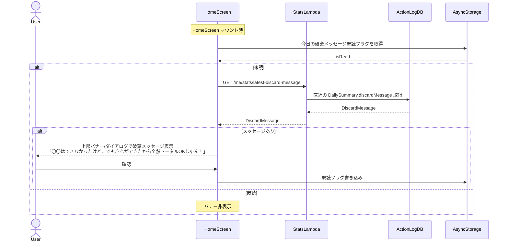

### 11. 学習データリセットフロー（FR-11-3）

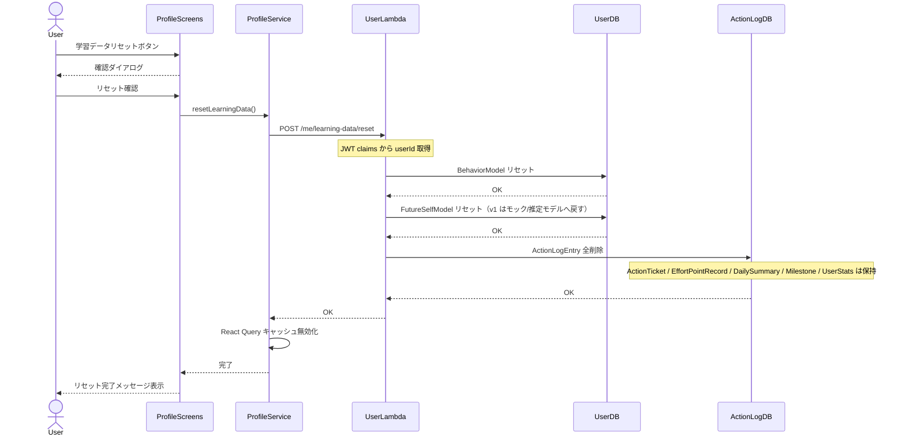

---

## 通信パターン

| パターン                   | 使用箇所                                                                                                                          |
| ---------------------- | ----------------------------------------------------------------------------------------------------------------------------- |
| **同期REST（HTTPS）**      | Frontend → API Gateway → Lambda（全通常API）。全てAPIClient経由                                                                         |
| **Amplify Auth直接（例外）** | Frontend → CognitoUserPool（サインアップ・サインイン・パスワードリセット）。**これは原則の例外として許容**。アカウント削除時のDynamoDB/Cognito削除はAPIClient経由でAccountLambdaを叩く |
| **Lambda内部呼び出し**       | なし                                                                                                                            |
| **EventBridge スケジュール** | 日次バッチ（DailyAggregationLambda 毎日0時）・週次バッチ（LearningEngineLambda 毎週月曜0時）                                                         |

## 認可方針

- **API Gateway の Cognito Authorizer** が JWT の署名・有効期限検証を行う
- Lambda は **JWT claims の `sub**` を認証済みの `userId` として使用する（`event.requestContext.authorizer.claims.sub`）
- API エンドポイントは `**/me/...**` 形式を採用し、URL path に userId を含めない
- path userId と JWT sub の一致確認（認可チェック）は構造上不要（path userId 自体が存在しないため）
- バッチ Lambda（DailyAggregationLambda / LearningEngineLambda）は API Gateway を通さないため認可対象外（EventBridge トリガー）

---

## 循環依存の排除

- Frontend サービス層はすべて APIClient を経由してバックエンドと通信する（直接Lambda呼び出しなし）。ただし認証系（Cognito）のみ Amplify Auth による直接通信を原則の例外として許容する
- Lambda間の直接呼び出しはなし
- EventBridgeトリガーのバッチ処理（DailyAggregationLambda・LearningEngineLambda）とAPI処理（その他Lambda）は完全に分離
- LearningEngineLambda は完全に非同期バッチ処理であり、他のLambdaから呼び出されない
- ZustandStore（authStore・ticketStore・recommendationStore）はサービス層から更新され、画面コンポーネントから読み取る（単方向データフロー）