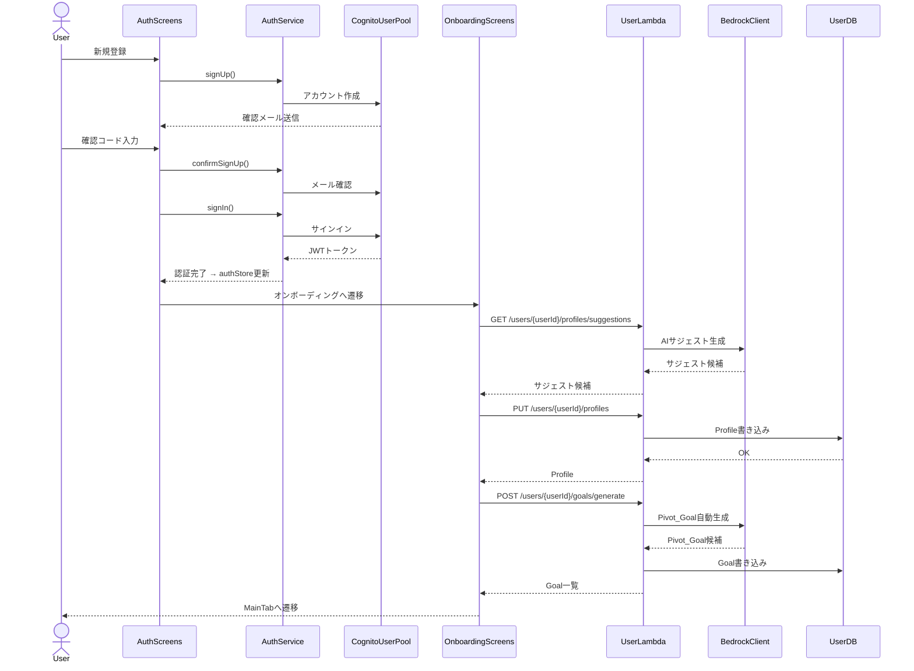
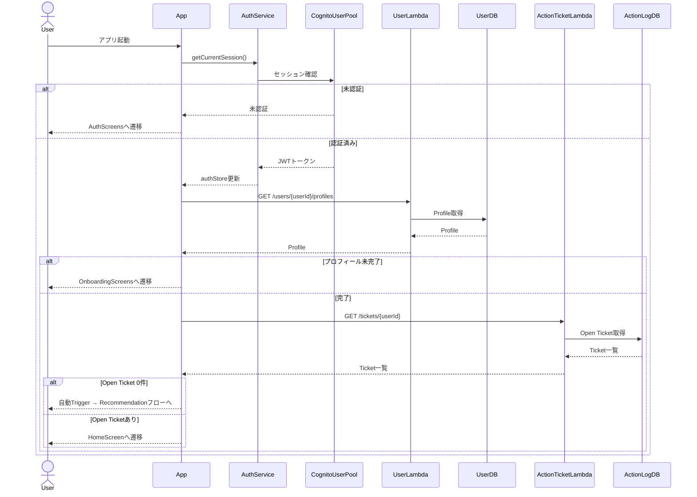
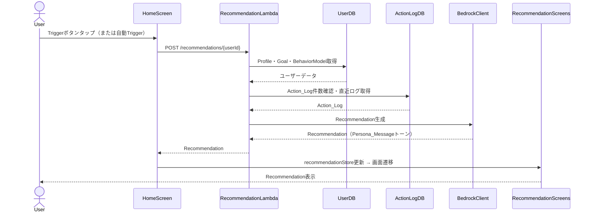
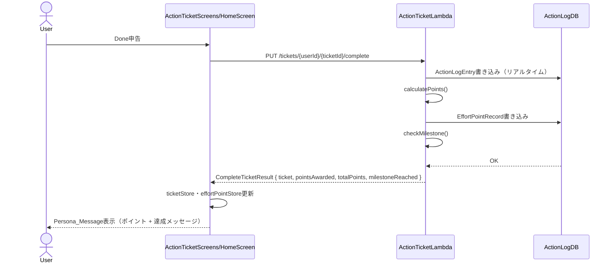
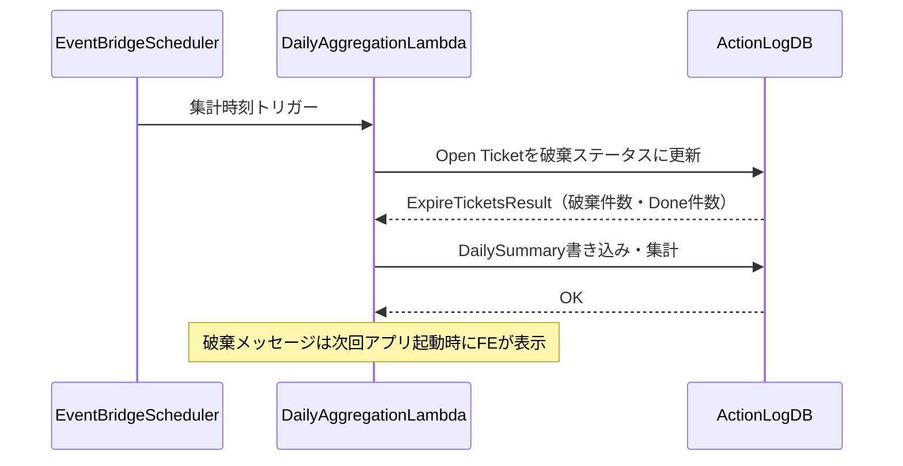
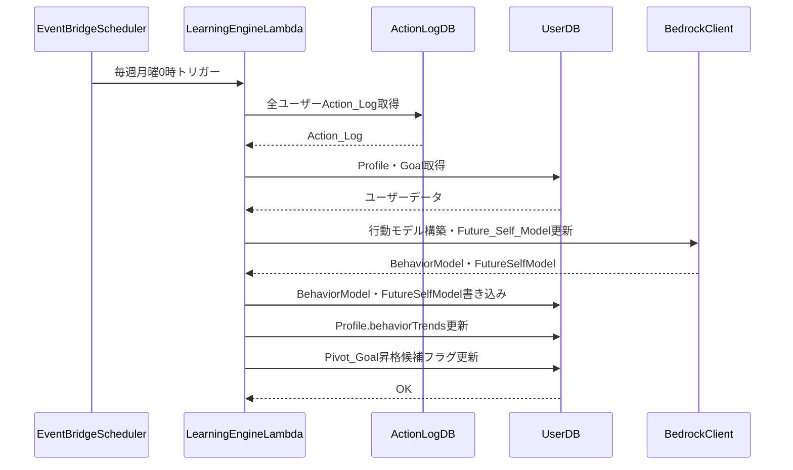
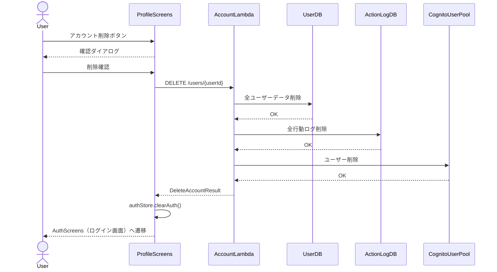

# コンポーネント依存関係 — だが、それでいい（DagaSoreDeIi_App）

## 概要

本ドキュメントは各コンポーネント間の依存関係と、主要ユースケースのデータフローを定義する。
「どのコンポーネントが何に依存しているか」「あるユースケースでデータがどう流れるか」を確認したいときに参照する。
コンポーネントの責務定義は [components.md](./components.md)、アーキテクチャ全体像は [application-design.md](./application-design.md) を参照。

## 目次

- [依存関係マトリクス](#依存関係マトリクス)
- [データフロー図](#データフロー図)
  - [1. 初期起動フロー（新規ユーザー）](#1-初期起動フロー新規ユーザー)
  - [2. アプリ起動フロー（既存ユーザー）](#2-アプリ起動フロー既存ユーザー)
  - [3. Recommendation生成フロー](#3-recommendation生成フロー)
  - [4. Done申告フロー](#4-done申告フロー)
  - [5. 日次集計・自動破棄フロー](#5-日次集計自動破棄フロー)
  - [6. 週次バッチフロー](#6-週次バッチフロー)
  - [7. アカウント削除フロー](#7-アカウント削除フロー)
- [通信パターン](#通信パターン)
- [循環依存の排除](#循環依存の排除)

---

## 依存関係マトリクス

| コンポーネント           | 依存先                                                                         |
| ------------------------ | ------------------------------------------------------------------------------ |
| AuthScreens              | AuthService(FE), NavigationComponent                                           |
| OnboardingScreens        | useProfileService, useGoalService, NavigationComponent                         |
| HomeScreen               | useTriggerService, useActionTicketService, useEffortPointService, ZustandStore |
| RecommendationScreens    | useRecommendationService, useActionTicketService, ZustandStore                 |
| ActionTicketScreens      | useActionTicketService, ZustandStore                                           |
| ProfileScreens           | useProfileService, useGoalService, ZustandStore                                |
| StatsScreens             | useEffortPointService, ZustandStore                                            |
| useAuthService           | AuthService(FE), APIClient, ZustandStore                                       |
| useProfileService        | APIClient, ZustandStore                                                        |
| useGoalService           | APIClient, ZustandStore                                                        |
| useTriggerService        | APIClient, ZustandStore                                                        |
| useRecommendationService | APIClient, ZustandStore                                                        |
| useActionTicketService   | APIClient, ZustandStore                                                        |
| useEffortPointService    | APIClient, ZustandStore                                                        |
| AuthService(FE)          | AWS Amplify Auth, CognitoUserPool                                              |
| APIClient                | AuthService(FE)（JWTトークン取得）                                             |
| AccountLambda            | UserDB, ActionLogDB, SimilarUserDB, CognitoUserPool                            |
| UserLambda               | UserDB, BedrockClient, BackendErrorHandler                                     |
| ActionTicketLambda       | ActionLogDB, BackendErrorHandler                                               |
| RecommendationLambda     | UserDB, ActionLogDB, BedrockClient, BackendErrorHandler                        |
| DailyAggregationLambda   | ActionLogDB, BackendErrorHandler                                               |
| StatsLambda              | ActionLogDB, BackendErrorHandler                                               |
| LearningEngineLambda     | UserDB, ActionLogDB, BedrockClient, BackendErrorHandler                        |
| EventBridgeScheduler     | LearningEngineLambda, DailyAggregationLambda                                   |

---

## データフロー図

### 1. 初期起動フロー（新規ユーザー）

### 2. アプリ起動フロー（既存ユーザー）

### 3. Recommendation生成フロー

### 4. Done申告フロー

### 5. 日次集計・自動破棄フロー

### 6. 週次バッチフロー

### 7. アカウント削除フロー

---

## 通信パターン

| パターン                     | 使用箇所                                                                   |
| ---------------------------- | -------------------------------------------------------------------------- |
| **同期REST（HTTPS）**        | Frontend → API Gateway → Lambda（全通常API）                               |
| **Lambda内部呼び出し**       | なし                                                                       |
| **EventBridge スケジュール** | 週次バッチ（LearningEngine）・日次バッチ（DailyAggregation）               |
| **Amplify Auth直接**         | Frontend → CognitoUserPool（サインアップ・サインイン・パスワードリセット） |

---

## 循環依存の排除

- Frontend サービス層はすべて APIClient を経由してバックエンドと通信する（直接Lambda呼び出しなし）
- Lambda間の直接呼び出しはなし
- EventBridgeトリガーのバッチ処理（DailyAggregationLambda・LearningEngineLambda）とAPI処理（その他Lambda）は完全に分離
- LearningEngineLambda は完全に非同期バッチ処理であり、他のLambdaから呼び出されない
- ZustandStore はサービス層から更新され、画面コンポーネントから読み取る（単方向データフロー）
