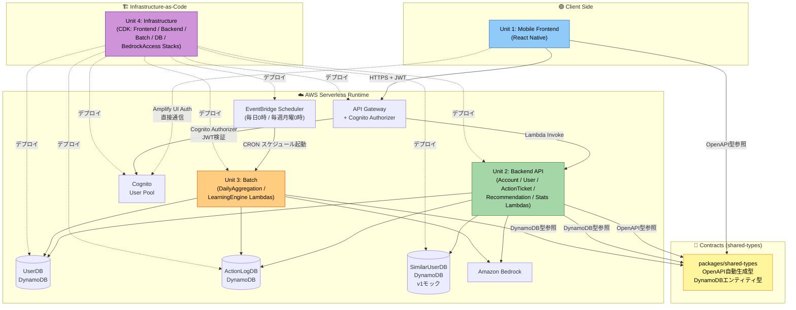
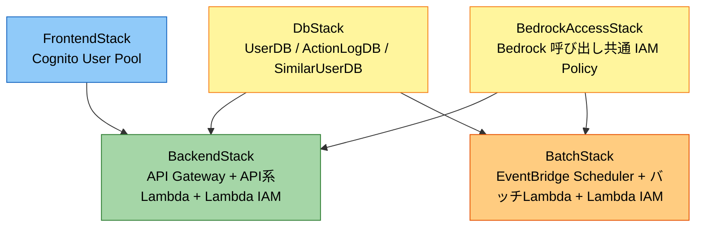

# ユニット間依存関係 — だが、それでいい（DagaSoreDeIi_App）

## 概要

本ドキュメントは、[unit-of-work.md](./unit-of-work.md) で定義した 4 ユニット間の依存関係と通信契約を定義する。  
Application Design の依存関係は [component-dependency.md](./component-dependency.md) を参照。

## 目次

- [概要](#概要)
- [ユニット間依存マトリクス](#ユニット間依存マトリクス)
- [ユニット間通信図](#ユニット間通信図)
- [インターフェース契約の詳細](#インターフェース契約の詳細)
- [CDK Stack 依存関係](#cdk-stack-依存関係)
- [共有リソースと非共有リソース](#共有リソースと非共有リソース)
- [デプロイ順序](#デプロイ順序)
- [循環依存の排除](#循環依存の排除)

---

## ユニット間依存マトリクス

「行 → 列」の向きで依存を示す。○ は直接依存、△ は契約経由の間接依存、✕ は依存なし。

| from \ to           | Mobile Frontend | Backend API | Batch | Infrastructure | packages/shared-types |
| ------------------- | --------------- | ----------- | ----- | -------------- | --------------------- |
| **Mobile Frontend** | —               | △（OpenAPI経由で型参照、実行時はAPI Gateway経由） | ✕ | △（ビルド時に Cognito User Pool ID / API Gateway Endpoint 等の CDK Output を Amplify 設定に埋め込む） | ○（OpenAPI由来の型を import） |
| **Backend API**     | ✕               | —           | ✕（Lambda 間の直接呼び出し禁止） | ✕（実行時はCDKが注入した環境変数を読むだけ） | ○（OpenAPI由来の型 + DBエンティティ型を import） |
| **Batch**           | ✕               | ✕（Lambda 間の直接呼び出し禁止） | —     | ✕（実行時はCDKが注入した環境変数を読むだけ） | ○（DynamoDBエンティティ型を import） |
| **Infrastructure**  | ✕（Mobileはストア配信のためCDKのデプロイ対象外） | ○（BackendStackでLambda成果物を取り込み） | ○（BatchStackでLambda成果物を取り込み） | —  | ✕ |
| **packages/shared-types** | ✕        | ✕           | ✕     | ✕              | —                     |

### 備考

- Mobile Frontend は Backend API に対して「実行時は API Gateway 経由の HTTPS 通信」「ビルド時は shared-types 経由の型共有」の 2 系統で依存する
- Mobile Frontend は Infrastructure に対して「CDK が生成する Cognito User Pool ID / Client ID / API Gateway Endpoint などの値をビルド時に取り込む」形で間接的に依存する。Infrastructure 側は Mobile のビルド成果物（IPA/APK）を扱わない（ストア配信は別経路）
- Backend API と Batch は同一リポジトリ内にあるが、コードを直接 import してはならない（Lambda 間の直接呼び出し禁止）
- Infrastructure は Backend / Batch の Lambda デプロイパッケージを取り込むが、逆方向（Lambda → CDK コード）の依存はない
- packages/shared-types は他ユニットからのみ参照され、他ユニットに依存しない（葉ノード）

---

## ユニット間通信図

---

## インターフェース契約の詳細

### Contract A: Mobile Frontend ↔ Backend API（OpenAPI）

| 項目                   | 内容                                                                                                                                                                 |
| ---------------------- | ------------------------------------------------------------------------------------------------------------------------------------------------------------------- |
| **通信プロトコル**     | HTTPS + REST                                                                                                                                                          |
| **認可**               | AWS Cognito JWT（API Gateway の Cognito Authorizer で検証）                                                                                                           |
| **契約定義**           | `apps/backend/openapi/openapi.yaml`（OpenAPI 3.x を Single Source of Truth）                                                                                          |
| **型生成**             | `openapi-typescript` で `packages/shared-types/src/api.ts` を自動生成                                                                                                 |
| **対象エンドポイント** | `/me/profile`、`/me/goals*`、`/me/tickets*`、`/me/recommendations*`、`/me/stats/*`、`/me/learning-data/reset`、`DELETE /me` 等（components.md 2.1〜2.5 の全エンドポイント） |
| **変更管理**           | OpenAPI 変更は PR で両ユニット（Mobile / Backend）のレビューを必須にする。破壊的変更時はバージョンフィールドまたは新エンドポイント追加で対応                        |

### Contract B: Mobile Frontend ↔ Cognito（Amplify Auth 直接通信・例外）

| 項目                   | 内容                                                                                                                                          |
| ---------------------- | --------------------------------------------------------------------------------------------------------------------------------------------- |
| **通信プロトコル**     | Amplify UI Authenticator → Cognito User Pool（HTTPS）                                                                                          |
| **対象機能**           | サインアップ、サインイン、パスワードリセット、メール確認、セッション管理                                                                       |
| **原則の例外**         | 「全通信は APIClient 経由」という原則の例外として許容（認証 UI とロジックを Amplify UI に一本化するため）                                      |
| **契約定義**           | Cognito User Pool 設定（パスワードポリシー、メール確認、属性）は Infrastructure Unit の FrontendStack で定義                                    |

### Contract C: Backend API ↔ DynamoDB（スキーマ契約）

| 項目                   | 内容                                                                                                                                                           |
| ---------------------- | ------------------------------------------------------------------------------------------------------------------------------------------------------------- |
| **スキーマ定義**       | `packages/shared-types/src/db.ts`（DynamoDB エンティティの TypeScript 型）                                                                                    |
| **アクセス対象**       | UserDB / ActionLogDB / SimilarUserDB                                                                                                                          |
| **アクセスパターン**   | components.md の Lambda ごとの依存に準拠（component-dependency.md の依存関係マトリクス）                                                                      |
| **エンティティ例**     | User、Profile、Goal、ActionTicket、ActionLogEntry、EffortPointRecord、DailySummary、Milestone、UserStats、FutureSelfModel、BehaviorModel、SimilarUserData   |

### Contract D: Batch ↔ DynamoDB（スキーマ契約）

Contract C と同じスキーマ（`packages/shared-types/src/db.ts`）を共有。  
Batch がアクセスするのは UserDB と ActionLogDB のみ（SimilarUserDB はアクセスしない）。

### Contract E: Batch ↔ EventBridge Scheduler

| 項目                   | 内容                                                                                                 |
| ---------------------- | --------------------------------------------------------------------------------------------------- |
| **トリガー**           | EventBridge Scheduler（`ScheduleExpression: cron(...)`）                                             |
| **タイムゾーン**       | 要件（FR-08-4・FR-13-4）で「毎日 0 時」固定が指定されているが、基準タイムゾーン（JST / UTC 等）は要件未定義。Construction Phase の Infrastructure Design で EventBridge Scheduler の `ScheduleExpressionTimezone` を明示的に設定して確定する |
| **ペイロード**         | EventBridge デフォルトのスケジュールイベント（追加引数なし）                                       |
| **スケジュール定義**   | Infrastructure Unit の BatchStack で CDK コードとして定義                                            |
| **対象 Lambda**        | DailyAggregationLambda（毎日 0 時）、LearningEngineLambda（毎週月曜 0 時）                           |

### Contract F: Backend API / Batch ↔ Amazon Bedrock

| 項目                   | 内容                                                                                                                       |
| ---------------------- | -------------------------------------------------------------------------------------------------------------------------- |
| **プロトコル**         | AWS SDK v3 経由                                                                                                            |
| **抽象化**             | 各ユニット内で `BedrockClient` interface を定義し、実装・モックを切り替え可能（Q8-A）                                        |
| **アクセス権限**       | Infrastructure Unit の BedrockAccessStack で IAM Policy を共通定義し、Lambda ロールに attach                                  |
| **利用する Lambda**    | UserLambda、RecommendationLambda、ActionTicketLambda（Backend API）、DailyAggregationLambda、LearningEngineLambda（Batch） |

### Contract G: Infrastructure ↔ 他ユニットの成果物

| 項目                   | 内容                                                                                                                                       |
| ---------------------- | ----------------------------------------------------------------------------------------------------------------------------------------- |
| **Lambda パッケージ**  | BackendStack は `apps/backend/dist/*.zip`、BatchStack は `apps/batch/dist/*.zip` を `lambda.Function` として取り込む                       |
| **OpenAPI 定義**       | 必要に応じて BackendStack が `apps/backend/openapi/openapi.yaml` を API Gateway の定義として参照（CDK の `SpecRestApi` 等）                 |
| **Cross-Stack Ref**    | DbStack の Export（テーブル名 ARN）を BackendStack / BatchStack が Import。BedrockAccessStack の IAM Policy ARN も同様に Cross-Stack 参照 |

---

## CDK Stack 依存関係

| Stack                  | 依存先（deploy順で先にデプロイすべきStack）               | 備考                                                                   |
| ---------------------- | --------------------------------------------------------- | ---------------------------------------------------------------------- |
| DbStack                | なし                                                      | 最下層。DynamoDB テーブル 3 つのみを定義                               |
| BedrockAccessStack     | なし                                                      | 最下層。Bedrock 呼び出し IAM Policy のみを定義                         |
| FrontendStack          | なし                                                      | Cognito User Pool のみを定義                                          |
| BackendStack           | DbStack、FrontendStack、BedrockAccessStack                | API Gateway + API 系 Lambda。Lambda に DB テーブル名・Cognito 情報・Bedrock Policy を注入 |
| BatchStack             | DbStack、BedrockAccessStack                               | EventBridge Scheduler + バッチ Lambda。Lambda に DB テーブル名・Bedrock Policy を注入 |

**Cross-Stack Reference の扱い**:

- DbStack から DynamoDB テーブル ARN / テーブル名を Export
- FrontendStack から Cognito User Pool ID / Client ID を Export
- BedrockAccessStack から IAM Policy ARN を Export
- 下流 Stack は SSM Parameter Store 経由または CDK Cross-Stack Reference で Import

---

## 共有リソースと非共有リソース

### 共有リソース（ユニット境界をまたぐ）

| リソース            | 共有するユニット                | 管理者                     | 変更時の影響範囲                                     |
| ------------------- | ------------------------------- | -------------------------- | --------------------------------------------------- |
| UserDB テーブル     | Backend API、Batch              | Infrastructure（DbStack）  | スキーマ変更は両ユニットに影響。`packages/shared-types` 経由で同期 |
| ActionLogDB テーブル | Backend API、Batch             | Infrastructure（DbStack）  | 同上                                                |
| SimilarUserDB テーブル | Backend API（RecommendationLambda のみ） | Infrastructure（DbStack）  | Backend API のみ影響                                |
| Cognito User Pool   | Mobile Frontend、Backend API    | Infrastructure（FrontendStack）| Cognito 設定変更は両ユニットに影響                   |
| Bedrock IAM Policy  | Backend API、Batch              | Infrastructure（BedrockAccessStack）| 権限変更は両ユニットに影響                          |
| OpenAPI 定義        | Mobile Frontend、Backend API    | Backend API（`apps/backend/openapi/`）| エンドポイント変更時は両ユニットの改修が必要           |
| `packages/shared-types` | Mobile Frontend、Backend API、Batch | 自動生成 + 手動補完    | 破壊的変更時は全アプリユニットを再ビルド              |

### 非共有リソース

| リソース                   | 所属ユニット    |
| -------------------------- | --------------- |
| Zustand stores / 画面状態  | Mobile Frontend |
| APIClient / React Query キャッシュ | Mobile Frontend |
| Backend API 内部のビジネスロジック | Backend API |
| Bedrock プロンプト（Backend API 用） | Backend API |
| Bedrock プロンプト（Batch 用）     | Batch        |
| バッチ実行の冪等性管理ロジック     | Batch        |

---

## デプロイ順序

**初回デプロイ**（Infrastructure を先にデプロイ → Lambda パッケージをアップロード）:

1. `packages/shared-types` をビルド（OpenAPI → TS 型の生成）
2. `apps/backend` をビルド（Lambda zip 成果物）
3. `apps/batch` をビルド（Lambda zip 成果物）
4. `apps/infra` で `cdk deploy` を実行:
   1. DbStack、BedrockAccessStack、FrontendStack（依存なし、並列可）
   2. BackendStack、BatchStack（上記 3 Stack を Import、並列可）
5. `apps/mobile` をビルドしてストア配信

**更新デプロイ（Lambda コードのみ変更）**:

- BackendStack または BatchStack を単独で `cdk deploy` することで差分更新
- ドキュメントレベルでは IaC ベースのブルー/グリーンや canary 戦略は Construction Phase で詳細化

**更新デプロイ（DynamoDB スキーマ変更）**:

- DbStack 更新 → 下流 Stack を順次デプロイ
- 破壊的変更はマイグレーションスクリプトを Batch Lambda で事前実行

---

## 循環依存の排除

- ユニット間で直接的なコード依存は `packages/shared-types` 経由のみ（単方向：shared-types は他ユニットに依存しない）
- Mobile Frontend → Backend API は実行時のみ（HTTPS）、逆方向の呼び出しは不在
- Mobile Frontend → Infrastructure はビルド時の設定値取り込みのみ（Cognito User Pool ID 等）、逆方向の依存はない（CDK は Mobile を扱わない）
- Backend API ↔ Batch は直接呼び出し禁止。データの受け渡しは DynamoDB のみ（EventBridge によるスケジュール起動は外部トリガー扱い）
- Infrastructure は Backend / Batch の Lambda デプロイパッケージを参照するが、逆方向の依存は存在しない（IaC は単方向）
- CDK Stack 間は単方向（DbStack / BedrockAccessStack / FrontendStack → BackendStack / BatchStack）
