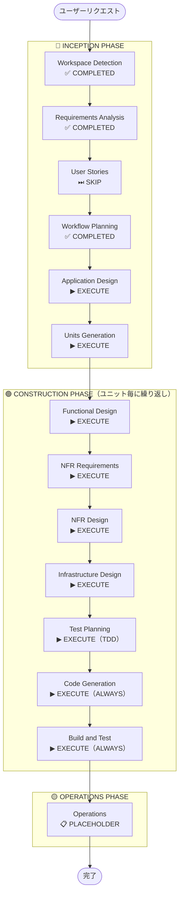

# 実行計画 — だが、それでいい（DagaSoreDeIi_App）

## 詳細分析サマリー

### 変更影響評価

| 影響領域         | 有無 | 説明                                                                          |
| ---------------- | ---- | ----------------------------------------------------------------------------- |
| ユーザー向け変更 | Yes  | モバイルアプリ全体がユーザー向け新規機能                                      |
| 構造的変更       | Yes  | 新規システム全体（Greenfield）— モバイル + バックエンド + AI/ML               |
| データモデル変更 | Yes  | DynamoDB スキーマ全体を新規設計（User/Profile/Goal/ActionTicket/ActionLog等） |
| API変更          | Yes  | Lambda + API Gateway による REST API を全て新規設計                           |
| NFR影響          | Yes  | パフォーマンス（起動3秒以内）・スケーラビリティ・プライバシー・可用性99.9%    |

### リスク評価

| 項目                   | 評価                                                                                                                                       |
| ---------------------- | ------------------------------------------------------------------------------------------------------------------------------------------ |
| **リスクレベル**       | High                                                                                                                                       |
| **理由**               | システム全体の新規構築。AI/ML（Bedrock）連携・複雑なビジネスロジック（Pivot/Learning Engine）・マルチプラットフォーム（iOS/Android）が絡む |
| **ロールバック複雑度** | Moderate（Greenfield のため既存への影響なし。ただし AWS リソース削除が必要）                                                               |
| **テスト複雑度**       | Complex（PBT・UIテスト・Bedrock連携テスト・DynamoDBシリアライゼーションテストが必要）                                                      |

---

## ワークフロー可視化



```
style WD fill:#4CAF50,stroke:#1B5E20,stroke-width:3px,color:#fff
style RA fill:#4CAF50,stroke:#1B5E20,stroke-width:3px,color:#fff
style WP fill:#4CAF50,stroke:#1B5E20,stroke-width:3px,color:#fff
style US fill:#BDBDBD,stroke:#424242,stroke-width:2px,stroke-dasharray: 5 5,color:#000
style AD fill:#FFA726,stroke:#E65100,stroke-width:3px,stroke-dasharray: 5 5,color:#000
style UG fill:#FFA726,stroke:#E65100,stroke-width:3px,stroke-dasharray: 5 5,color:#000
style FD fill:#FFA726,stroke:#E65100,stroke-width:3px,stroke-dasharray: 5 5,color:#000
style NFRA fill:#FFA726,stroke:#E65100,stroke-width:3px,stroke-dasharray: 5 5,color:#000
style NFRD fill:#FFA726,stroke:#E65100,stroke-width:3px,stroke-dasharray: 5 5,color:#000
style ID fill:#FFA726,stroke:#E65100,stroke-width:3px,stroke-dasharray: 5 5,color:#000
style TP fill:#FFA726,stroke:#E65100,stroke-width:3px,stroke-dasharray: 5 5,color:#000
style CG fill:#4CAF50,stroke:#1B5E20,stroke-width:3px,color:#fff
style BT fill:#4CAF50,stroke:#1B5E20,stroke-width:3px,color:#fff
style OPS fill:#FFF59D,stroke:#F9A825,stroke-width:2px,color:#000
style Start fill:#CE93D8,stroke:#6A1B9A,stroke-width:3px,color:#000
style End fill:#CE93D8,stroke:#6A1B9A,stroke-width:3px,color:#000
linkStyle default stroke:#333,stroke-width:2px
```

---

## 実行するステージ一覧

### 🔵 INCEPTION PHASE

- [x] Workspace Detection — COMPLETED
- [x] Requirements Analysis — COMPLETED
- [ ] User Stories — **SKIP**
  - **理由**: 本アプリはユーザーペルソナが単一（日本語ユーザー）で、要件ドキュメントに機能要件・非機能要件が詳細に記載済み。User Storiesが追加する価値は低い。
- [x] Workflow Planning — COMPLETED
- [ ] Application Design — **EXECUTE**
  - **理由**: React Native画面コンポーネント・Lambda関数・DynamoDBテーブル・Bedrock連携など、多数の新規コンポーネントとサービス層の設計が必要。
- [ ] Units Generation — **EXECUTE**
  - **理由**: モバイルフロントエンド・バックエンドAPI・AI/MLコンポーネント・インフラ（CDK）の4つの独立したユニットに分解して並行開発する必要がある。

### 🟢 CONSTRUCTION PHASE（各ユニット毎に実行）

- [ ] Functional Design — **EXECUTE**
  - **理由**: DynamoDBスキーマ（User/Profile/Goal/ActionTicket/ActionLog等）・Pivot判定ロジック・Effort_Point計算・Learning Engine切り替え（7件閾値）など複雑なビジネスロジックの詳細設計が必要。
- [ ] NFR Requirements — **EXECUTE**
  - **理由**: 起動3秒以内・API応答1秒以内・Bedrock10秒タイムアウト・可用性99.9%・GDPR準拠72時間削除など、具体的なNFR要件が多数存在する。
- [ ] NFR Design — **EXECUTE**
  - **理由**: NFR Requirementsを実行するため。DynamoDBオンデマンドキャパシティ・Lambdaコールドスタート対策・Bedrockフォールバック設計などのNFRパターン実装が必要。
- [ ] Infrastructure Design — **EXECUTE**
  - **理由**: AWS CDKによるインフラ定義（Cognito UserPool・DynamoDBテーブル・Lambda関数・API Gateway・IAMロール）の詳細設計が必要。
- [ ] Test Planning — **EXECUTE**（TDD）
  - **理由**: TDDアプローチを採用するため、Code Generation前にテストコードまたはテストケースを作成する。対象: ユニットテスト（純粋関数・ビジネスロジック）・PBT（Effort_Point計算・シリアライゼーション）・UIテスト（React Native Testing Library）・統合テスト（Lambda + DynamoDB）。テストが先に存在することでCode Generationの実装方針を明確化し、品質を担保する。
- [ ] Code Generation — **EXECUTE**（ALWAYS）
  - **理由**: 実装計画と全コード生成が必要。Test Planningで作成したテストをパスする実装を行う（Red → Green → Refactor）。
- [ ] Build and Test — **EXECUTE**（ALWAYS）
  - **理由**: ビルド・テスト・検証が必要。

### 🟡 OPERATIONS PHASE

- [ ] Operations — **PLACEHOLDER**
  - **理由**: 将来のデプロイ・モニタリングワークフロー用プレースホルダー。

---

## 想定ユニット構成（Units Generation で確定）

| ユニット                 | 内容                                                                    | 主要技術                                    |
| ------------------------ | ----------------------------------------------------------------------- | ------------------------------------------- |
| Unit 1: Mobile Frontend  | React Native アプリ（全画面・ナビゲーション・状態管理）                 | React Native, TypeScript, React Navigation  |
| Unit 2: Backend API      | Lambda関数群 + API Gateway（認証・Goal・Ticket・Profile・Effort_Point） | Node.js/TypeScript, AWS Lambda, API Gateway |
| Unit 3: AI/ML Components | Bedrock連携（Recommendation・Persona_Message・Learning Engine）         | Amazon Bedrock, Lambda, DynamoDB            |
| Unit 4: Infrastructure   | AWS CDKによるインフラ定義（全AWSリソース）                              | AWS CDK, TypeScript                         |

---

## 推定タイムライン

| フェーズ          | ステージ数                                         | 備考                   |
| ----------------- | -------------------------------------------------- | ---------------------- |
| INCEPTION（残り） | 2ステージ（Application Design + Units Generation） |                        |
| CONSTRUCTION      | 7ステージ × 4ユニット                              | ユニット毎に繰り返し   |
| OPERATIONS        | プレースホルダー                                   |                        |
| **合計**          | **約30ステージ**                                   | ユニット数確定後に調整 |

---

## 成功基準

- **主目標**: v1スコープの全機能要件（FR-01〜FR-13）を実装したモバイルアプリの完成
- **主要成果物**:
  - React Native アプリ（iOS + Android）
  - AWS サーバーレスバックエンド（Lambda + API Gateway + DynamoDB + Cognito）
  - Amazon Bedrock 連携（Recommendation・Persona_Message・Learning Engine）
  - AWS CDK インフラコード
  - テストスイート（PBT + UIテスト + DynamoDBシリアライゼーションテスト）
- **品質ゲート**:
  - 全機能要件（FR-01〜FR-13）の実装完了
  - 非機能要件（NFR-01〜NFR-06）の充足
  - **全テスト件数 Pass**（ユニットテスト・PBT・UIテスト・統合テスト）
  - **カバレッジ 80% 以上**（Statements カバレッジ 80%以上 かつ Branch カバレッジ 80%以上）
  - PBT（純粋関数・シリアライゼーション）パス
  - React Native Testing Library UIテストパス
  - Bedrock タイムアウト・フォールバック動作確認
